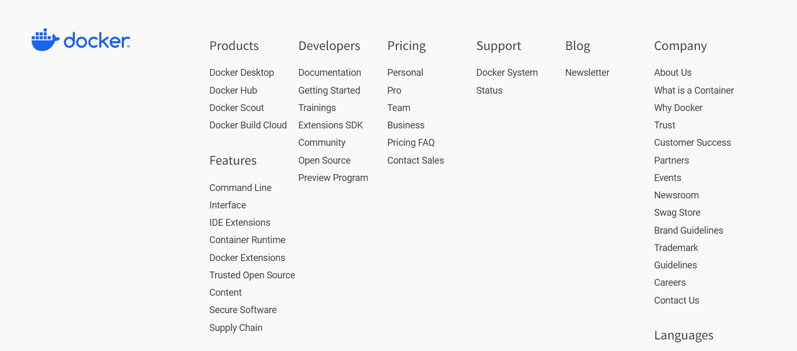
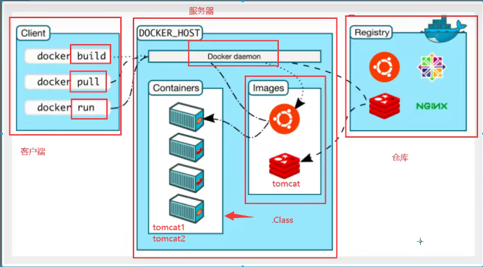

> ## Docker 学习

- Docker概述
- Docker安装
- Docker命令
  - 镜像
  - 容器
  - 操作
  - ....
- Docker镜像

- 容器数据卷
- DockerFile
- Docker网络原理
- IDEA整合Docker
- Docker Compose
- Docker Swarm 
- CI\CD jenkins

------

# Docker 概述

## Docker 为什么出现？

产品：开发--上线  两套环境！ 应用环境，应用配置！

开发  -----  运维。   问题：我在我的电脑上能运行！ 版本更新导致服务不可用！

开发即运维

环境配置十分麻烦，每个机器都要部署环境（集群Redis、ES、Hadoop....) 费时费力。

发表项目 (jar + (Redis MySQL jdk ES))，项目能不能带上环境安装包

之前在服务器配置一个应用环境Redis MySQL jdk ES Hadoop，配置麻烦，不能跨平台

Windows，最后发布到Linux！！

传统：jar  运维来部署

现在：开发打包部署上线，一套流程做完！


Docker 给以上的问题，提供了解决方案！


Docker的思想就是来源于集装箱

JRE -- 多个应用（端口冲突）

隔离：Docker核心思想！打包装箱！每个箱子是相互隔离的

Docker 通过隔离机制，可以将服务器利用到极致！


## Docker 的历史

2010年，几个搞IT的小伙在美国成立了一家公司 `dotCloud`

做一些 pass 的云计算服务！  LXC 有关的容器技术！

他们将自己的技术（容器化技术）命名就是Docker！

但是没有引起行业注意，活不下去

`开源`

开发源代码

2013年，Docker开源！

Docker越来越多人发现其优点

2014年4月9日，Docker1.0发布 ！


**Dokcer 为什么火！ 因为轻巧！**

在容器技术之前，我们都是使用虚拟机技术

虚拟机：在window中装一个Vmware，通过这个软件虚拟出多台电脑！笨重！

虚拟机也是属于虚拟化技术，Docker容器技术也是一样

```shell
vm ： Linux centos原生镜像(一台电脑！)， 隔离，需要开启多个虚拟机！ 几个G  几分钟
docker：隔离，镜像(最核心的环境 4m + jdk + mysql) 十分小巧，运行镜像即可！ 小巧  几个M KB 秒级启动！
```


> 聊聊Docker

Docker 是基于 Go 语言开发的！开源项目

官网：https://www.docker.com/



文档地址：https://docs.docker.com/  Docker的文档是超级详细的！

仓库地址：https://hub.docker.com/ 

## Docker 能干什么？

> 虚拟机技术缺点

- 资源占用多
- 冗余步骤多
- 启动很慢

> 容器化技术

==容器化技术不是模拟一个完整的系统==

比较Docker与传统虚拟机的不同：

- 传统虚拟机，虚拟出一套硬件，运行完整的操作系统，然后在安装运行软件
- 容器内的应用，直接运行在宿主机的内核，容器没有自己的内核，没有虚拟硬件，所以就轻便了
- 每个容器间是相互隔离的，每个容器内都有一个属于自己的文件系统，互不干扰

> DevOps（开发、运维）

**应用更快速的交互和部署**

传统：一堆帮助文件，安装程序

Docker：打包镜像发布测试，一键运行

**更便捷的升级和扩容**

使用Docker以后，部署应用与搭积木类似

项目打包为一个镜像，扩展 服务器A！  服务器B 一键运行镜像

**更简单的系统运维**

在容器化以后，开发，测试环境都是高度一致的

**更高效的计算资源利用**

Docker 是内核级的虚拟化，可以在一个物理机上运行很多的容器实例！彻底压榨服务器性能！

# Docker 安装

## Docker的基本组成



**镜像（image）：**

docker镜像就像一个模板，可以通过这个模板来创建容器服务，tomcat镜像\==> run==>tomcat01容器（提供服务）

通过这个镜像可以创建多个容器（最终服务运行或者项目运行就是在容器中）

**容器（container）：**

Docker利用容器技术，独立运行一个或者一组应用，通过镜像来创建。

启动，停止，删除，基本命令！

目前可以将容器理解为一个简易的Linux系统

**仓库（repository）：**

用来存放镜像的地方！

仓库分为公有仓库和私有仓库！

Docker Hub（默认是国内的）

阿里云（配置镜像加速）

## 安装Docker

> 环境准备

1、需要会Linux的基础

2、CentOS 7

3、使用Xshell连接远程服务器进行操作！

> 环境查看

> 安装

帮助文档 