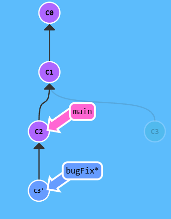
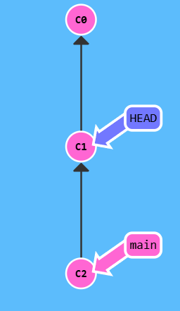

# 教学资源

- ⭐️ 猴子都能懂的 Git 入门：https://backlog.com/git-tutorial/cn/（强烈推荐）

- ⭐️ Learning Git Branching：https://learngitbranching.js.org/?locale=zh_CN（帮助你学习 Git 分支的用法）

- ⭐️ Git 命令大全：https://backlog.com/git-tutorial/cn/reference/（适合收藏）
- ⭐️ Git 官方文档：https://git-scm.com/book/zh/v2（强烈推荐，有图有文，全面详细）

# Git 入门基础

## **Git 主要命令**

### git commit

Git 仓库中的提交记录保存的是你的目录下所有文件的快照，就像是把整个目录复制，然后再粘贴一样

执行两次 `git commit` 后的效果

<table>
  <tr>
    <td style="text-align: center; padding: 10px;">
      
    </td>
    <td style="text-align: center; padding: 10px;">
      
    </td>
  </tr>
</table>


### git branch

用于创建新的分支

创建分支，并移动到分支位置，*表示当前分支

```bash
git branch bugFix
git checkout bugFix
# 或者
git checkout -b bugFix
```

### git merge

在 Git 中合并两个分支时会产生一个特殊的提交记录，它有两个 parent 节点。

使用 `git merge bugFix` 将 `bugFix` 分支融合到 `main` 中

`git checkout bugFix; git merge main` 切换到 `bugFix` 分支然后与 `main` 融合

<table>
  <tr>
    <td style="text-align: center; padding: 10px;">
      
    </td>
    <td style="text-align: center; padding: 10px;">
      
    </td>
    <td style="text-align: center; padding: 10px;">
      
    </td>
  </tr>
</table>

### git rebase

Rebase 实际上就是取出一系列的提交记录，“复制”它们，然后在另外一个地方逐个的放下去。

<table>
  <tr>
    <td style="text-align: center; padding: 10px;">
      
    </td>
    <td style="text-align: center; padding: 10px;">
      
    </td>
    <td style="text-align: center; padding: 10px;">
      
    </td>
  </tr>
</table>

## Git 特性

HEAD 是一个对**当前所在分支**的符号引用 —— 也就是指向你正在其基础上进行工作的提交记录。

HEAD 总是指向当前分支上最近一次提交记录。大多数修改提交树的 Git 命令都是从改变 HEAD 的指向开始的。

### 分离的 HEAD

让其指向了某个具体的提交记录而不是分支名。

使用 `git checkout c4` 将 `Head` 从 `bugFix` 分支指向 `c4` （提交记录上的标签（哈希值）

<table>
  <tr>
    <td style="text-align: center; padding: 10px;">
      
    </td>
    <td style="text-align: center; padding: 10px;">
      
    </td>
  </tr>
</table>

### 相对引用

通过指定提交记录哈希值的方式在 Git 中移动不太方便。在实际应用时，并没有像本程序中这么漂亮的可视化提交树供你参考，所以你就不得不用 `git log` 来**查看提交记录的哈希值**。（回应上一部分使用哈希值进行移动 `HEAD` ）

相对引用非常给力，这里我介绍两个简单的用法：

- 使用 `^` 向上移动 1 个提交记录
- 使用 `~<num>` 向上移动多个提交记录，如 `~3`

**操作符 (^)**：表示让 Git 寻找指定提交记录的 parent 提交。

当执行 `git checkout main^` ，将 `HEAD` 移动到 `main` 的 `parent` ，即 `c1`



你也可以将 `HEAD` 作为相对引用的参照。下面咱们就用 `HEAD` 在提交树中向上移动几次。

**“~”操作符**：该操作符后面可以跟一个数字（可选，不跟数字时与 `^` 相同，向上移动一次），指定向上移动多少次。

### 移动分支

可以直接使用 `-f` 选项让分支指向另一个提交。

`git branch -f main HEAD~3`

上面的命令会将 main 分支强制指向 HEAD 的第 3 级 parent 提交。

### 撤销变更

主要有两种方法用来撤销变更 —— 一是 `git reset`，还有就是 `git revert`。接下来咱们逐个进行讲解。

- `git reset` 通过把分支记录回退几个提交记录来实现撤销改动。
- `git revert`为了撤销更改并**分享**给别人

**执行 `git reset HEAD~1`** 

Git 把 `main` 分支移回到 `C1`；现在我们的本地代码库根本就不知道有 `C2` 这个提交了。


**执行`git revert HEAD`**

在我们要撤销的提交记录后面居然多了一个新提交！这是因为新提交记录 `C2'` 引入了**更改** —— 这些更改刚好是用来撤销 `C2` 这个提交的。也就是说 **`C2'` 的状态与 `C1` 是相同的**。

revert 之后就可以把更改推送到远程仓库与别人分享。


## 修改提交树

### 整理提交记录

`git cherry-pick` ：如果你想将一些提交复制到当前所在的位置（`HEAD`）下面的话， Cherry-pick 是最直接的方式了。

- `git cherry-pick <提交号>...`

例子：

我们只需要提交记录 `C2` 和 `C4`，所以 Git 就将被它们抓过来放到当前分支下了。

`git cherry-pick C2 C4`

<table>
  <tr>
    <td style="text-align: center; padding: 10px;">
      
    </td>
    <td style="text-align: center; padding: 10px;">
      
    </td>
  </tr>
</table>

### 交互式的 rebase

上述方式需要使用提交记录的哈希值，故使用起来没有想象中的简单

如果你不清楚你想要的提交记录的哈希值呢? 幸好 Git 帮你想到了这一点, 我们可以利用交互式的 rebase —— 如果你想从一系列的提交记录中找到想要的记录, 这就是最好的方法了

交互式 rebase 指的是使用带参数 `--interactive` 的 rebase 命令, 简写为 `-i`

如果你在命令后增加了这个选项, Git 会打开一个 **UI 界面**并列出将要被复制到目标分支的备选提交记录，它还会显示每个提交记录的哈希值和提交说明，提交说明有助于你理解这个提交进行了哪些更改。

当 rebase UI界面打开时, 你能做3件事:

- 调整提交记录的顺序（通过鼠标拖放来完成）
- 删除你不想要的提交（通过切换 `pick` 的状态来完成，关闭就意味着你不想要这个提交记录）
- 合并提交。 遗憾的是由于某种逻辑的原因，我们的课程不支持此功能，因此我不会详细介绍这个操作。简而言之，它允许你把多个提交记录合并成一个。

`git rebase -i HEAD~4` ：当前 `HEAD` 的第四个 `parent` 的位置


## Git 技术、技巧与贴士大集合

### 本地栈式提交

来看一个在开发中经常会遇到的情况：我正在解决某个特别棘手的 Bug，为了便于调试而在代码中添加了一些调试命令并向控制台打印了一些信息。

这些调试和打印语句都在它们各自的提交记录里。最后我终于找到了造成这个 Bug 的根本原因，解决掉以后觉得沾沾自喜！

最后就差把 `bugFix` 分支里的工作合并回 `main` 分支了。你可以选择通过 fast-forward 快速合并到 `main` 分支上，但这样的话 `main` 分支就会包含我这些调试语句了。你肯定不想这样，应该还有更好的方式……

实际我们只要让 Git 复制解决问题的那一个提交记录就可以了。跟之前我们在“整理提交记录”中学到的一样，我们可以使用

- `git rebase -i`：使用 UI 界面进行操作
- `git cherry-pick`：在当前 `HEAD` 下增加一条指定节点的分支

### 提交的技巧 #1

接下来这种情况也是很常见的：你之前在 `newImage` 分支上进行了一次提交，然后又基于它创建了 `caption` 分支，然后又提交了一次。

此时你想对某个以前的提交记录进行一些小小的调整。比如设计师想修改一下 `newImage` 中图片的分辨率，尽管那个提交记录并不是最新的了。

我们可以通过下面的方法来克服困难：

- 先用 `git rebase -i` 将提交重新排序，然后把我们想要修改的提交记录挪到最前
- 然后用 `git commit --amend` 来进行一些小修改
- 接着再用 `git rebase -i` 来将他们调回原来的顺序
- 最后我们把 main 移到修改的最前端（用你自己喜欢的方法），就大功告成啦！

实例

```
git rebase -i HEAD~2
git commit --amend
git rebase -i HEAD~2
// 下面这条命令，不仅把 main 挪到了最前面，还将 HEAD 指向了 main，完美
git branch -f main caption

git checkout main
git cherry-pick newImage
git commit --amend
git cherry-pick caption
```


<table>
  <tr>
    <td style="text-align: center; padding: 10px;">
      
    </td>
    <td style="text-align: center; padding: 10px;">
      
    </td>
  </tr>
</table>


