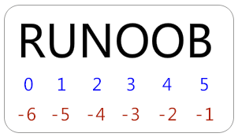

# Python 入门

## Python 开发工具

- IDLE：自带的开发工具
- PyCharm：主流的开发工具
- Sublime Text：跨平台的、轻量级的代码编辑器
- Eric：开源代码编辑器和集成开发环境

## Python 学习方法


## PyCharm 使用技巧

- 常用快捷键

  - `shift + delete` ：删除当前行

  - `ctrl + D` ：复制当前行

  - `ctrl + /` ：添加注释

  - `ctrl + alt + L` ：快速格式化

  - `ctrl + shift + F10`  ：快速运行程序，自定义为 `alt + R`

    

    添加快捷键 `alt + R`

  - `ctrl + H` ：查看一个类的层级关系 [学习OOP继承关系]
  
  - `ctrl + C/V/X` ：复制、粘贴、剪切
  
  -  `ctrl + F` ：查找
  
  - `ctrl + R`  ：替换

## Python 转义字符


- \r : 将前面输入内容覆盖  

## Python 注释

- 单行注释
- 多行注释 ：使用 \```xxx``` 进行注释
- 文件编码声明注释 ：格式 # coding:

## Python 基础语法

### import 与 from...import

将整个模块(somemodule)导入，格式为： **import somemodule**

从某个模块中导入某个函数,格式为： **from somemodule import somefunction**

从某个模块中导入多个函数,格式为： **from somemodule import firstfunc, secondfunc, thirdfunc**

将某个模块中的全部函数导入，格式为： **from somemodule import \***

|     特性     |         `import somemodule`         |  `from somemodule import *`  |
| :----------: | :---------------------------------: | :--------------------------: |
| **命名空间** |     所有内容在 `somemodule.` 下     |    直接导入到当前命名空间    |
| **变量冲突** | 不会冲突（需用 `somemodule.` 访问） | 可能冲突（同名变量会被覆盖） |
|  **可读性**  |         更清晰（明确来源）          |   较差（难以追踪变量来源）   |
|   **性能**   |       稍慢（需通过模块访问）        |       稍快（直接访问）       |
| **推荐使用** |      ✅ 推荐（更安全、更清晰）       |   ❌ 不推荐（除非特殊情况）   |

### Python 标识符

在 Python 里，标识符由 **字母、数字、下划线** 组成

以下划线开头的标识符是有特殊意义的。以单下划线开头 **_foo** 的代表不能直接访问的类属性，需通过类提供的接口进行访问，不能用 **from xxx import \*** 而导入

以双下划线开头的 **__foo** 代表类的私有成员，以双下划线开头和结尾的 **__foo__** 代表 Python 里特殊方法专用的标识，如 **__init__()** 代表类的构造函数

## Python 基本数据类型

### 多个变量赋值

Python允许你同时为多个变量赋值。例如：

```python
a = b = c = 1
```

以上实例，创建一个整型对象，值为1，三个变量被分配到相同的内存空间上。

您也可以为多个对象指定多个变量。例如：

```python
a, b, c = 1, 2, "john"
```

### 标准数据类型

Python3 中常见的数据类型有：

- Number（数字）
  - isinstance 和 type 的区别在于：
    - type()不会认为子类是一种父类类型。
    - isinstance()会认为子类是一种父类类型。
- String（字符串）
- bool（布尔类型）
- List（列表）
- Tuple（元组）
- Set（集合）
- Dictionary（字典）

### Python 数字

数字数据类型用于存储数值

他们是 **不可改变** 的数据类型，这意味着改变数字数据类型会分配一个新的对象

Python支持四种不同的数字类型：

- int（有符号整型）
- long（长整型，也可以代表八进制和十六进制）
- float（浮点型）
- complex（复数）

| int    | long                  | float      | complex    |
| :----- | :-------------------- | :--------- | :--------- |
| 10     | 51924361L             | 0.0        | 3.14j      |
| 100    | -0x19323L             | 15.20      | 45.j       |
| -786   | 0122L                 | -21.9      | 9.322e-36j |
| 080    | 0xDEFABCECBDAECBFBAEl | 32.3e+18   | .876j      |
| -0490  | 535633629843L         | -90.       | -.6545+0J  |
| -0x260 | -052318172735L        | -32.54e100 | 3e+26J     |
| 0x69   | -4721885298529L       | 70.2E-12   | 4.53e-7j   |

> **注意：**long 类型只存在于 Python2.X 版本中，在 2.2 以后的版本中，int 类型数据溢出后会自动转为long类型。**在 Python3.X 版本中 long 类型被移除，使用 int 替代。**

### Python字符串

字符串或串(String)是由数字、字母、下划线组成的一串字符。

python的字串列表有2种取值顺序:

- 从左到右索引默认0开始的，最大范围是字符串长度少1
- 从右到左索引默认-1开始的，最大范围是字符串开头



**【头下标:尾下标】** 获取的子字符串包含头下标的字符，但**不包含尾下标**的字符。

```bash
>>> s = 'abcdef'
>>> s[1:5]
'bcde'
```

### Python列表

列表可以完成大多数集合类的数据结构实现。它支持字符，数字，字符串甚至可以包含列表（即嵌套）

列表用  `[ ]`  标识，是 python 最通用的复合数据类型。

感觉与字符串类似


Python 列表截取可以接收第三个参数，参数作用是截取的步长，以下实例在索引 1 到索引 4 的位置并设置为步长为 2（间隔一个位置）来截取字符串：


### Python 元组

元组是另一个数据类型，类似于 List（列表）。

元组用  `()`  标识。内部元素用逗号隔开。但是元组**不能二次赋值**，相当于只读列表

### Python 字典

字典 (dictionary) 是除列表以外 python 之中最灵活的内置数据结构类型。列表是有序的对象集合，字典是**无序的对象集合**

字典当中的元素是通过 **键** 来存取的

字典用 `{ }` 标识。字典由索引 (key) 和它对应的值 (value) 组成

``````python
dict = {}
dict['one'] = "This is one"
dict[2] = "This is two"
 
tinydict = {'name': 'runoob','code':6734, 'dept': 'sales'}
 
print dict['one']          # 输出键为'one' 的值
print dict[2]              # 输出键为 2 的值
print tinydict             # 输出完整的字典
print tinydict.keys()      # 输出所有键
print tinydict.values()    # 输出所有值
``````
输出结果为：
```
This is one
This is two
{'dept': 'sales', 'code': 6734, 'name': 'runoob'}
['dept', 'code', 'name']
['sales', 6734, 'runoob']
```

### Python数据类型转换

| 函数                                                         | 描述                                                |
| :----------------------------------------------------------- | :-------------------------------------------------- |
| [int(x [,base\])](https://www.runoob.com/python/python-func-int.html) | 将x转换为一个整数                                   |
| [long(x [,base\] )](https://www.runoob.com/python/python-func-long.html) | 将x转换为一个长整数                                 |
| [float(x)](https://www.runoob.com/python/python-func-float.html) | 将x转换到一个浮点数                                 |
| [complex(real [,imag\])](https://www.runoob.com/python/python-func-complex.html) | 创建一个复数                                        |
| [str(x)](https://www.runoob.com/python/python-func-str.html) | 将对象 x 转换为字符串                               |
| [repr(x)](https://www.runoob.com/python/python-func-repr.html) | 将对象 x 转换为表达式字符串                         |
| [eval(str)](https://www.runoob.com/python/python-func-eval.html) | 用来计算在字符串中的有效Python表达式,并返回一个对象 |
| [tuple(s)](https://www.runoob.com/python/att-tuple-tuple.html) | 将序列 s 转换为一个元组                             |
| [list(s)](https://www.runoob.com/python/att-list-list.html)  | 将序列 s 转换为一个列表                             |
| [set(s)](https://www.runoob.com/python/python-func-set.html) | 转换为可变集合                                      |
| [dict(d)](https://www.runoob.com/python/python-func-dict.html) | 创建一个字典。d 必须是一个序列 (key,value)元组。    |
| [frozenset(s)](https://www.runoob.com/python/python-func-frozenset.html) | 转换为不可变集合                                    |
| [chr(x)](https://www.runoob.com/python/python-func-chr.html) | 将一个整数转换为一个字符                            |
| [unichr(x)](https://www.runoob.com/python/python-func-unichr.html) | 将一个整数转换为Unicode字符                         |
| [ord(x)](https://www.runoob.com/python/python-func-ord.html) | 将一个字符转换为它的整数值                          |
| [hex(x)](https://www.runoob.com/python/python-func-hex.html) | 将一个整数转换为一个十六进制字符串                  |
| [oct(x)](https://www.runoob.com/python/python-func-oct.html) | 将一个整数转换为一个八进制字符串                    |

## Python 运算符

### Python逻辑运算符

| 运算符 | 逻辑表达式 | 描述                                                         | 实例                    |
| :----- | :--------- | :----------------------------------------------------------- | :---------------------- |
| and    | x and y    | 布尔"与" - 如果 x 为 False，x and y 返回 False，否则它返回 y 的计算值。 | (a and b) 返回 20。     |
| or     | x or y     | 布尔"或" - 如果 x 是非 0，它返回 x 的计算值，否则它返回 y 的计算值。 | (a or b) 返回 10。      |
| not    | not x      | 布尔"非" - 如果 x 为 True，返回 False 。如果 x 为 False，它返回 True。 | not(a and b) 返回 False |

### Python成员运算符

除了以上的一些运算符之外，Python还支持成员运算符，测试实例中包含了一系列的成员，包括 **字符串，列表或元组**

| 运算符 | 描述                                                    | 实例                                              |
| :----- | :------------------------------------------------------ | :------------------------------------------------ |
| in     | 如果在指定的序列中找到值返回 True，否则返回 False。     | x 在 y 序列中 , 如果 x 在 y 序列中返回 True。     |
| not in | 如果在指定的序列中没有找到值返回 True，否则返回 False。 | x 不在 y 序列中 , 如果 x 不在 y 序列中返回 True。 |

### Python身份运算符

身份运算符用于比较两个对象的存储单元

| 运算符 | 描述                                        | 实例                                                         |
| :----- | :------------------------------------------ | :----------------------------------------------------------- |
| is     | is 是判断两个标识符是不是引用自一个对象     | **x is y**, 类似 **id(x) == id(y)** , 如果引用的是同一个对象则返回 True，否则返回 False |
| is not | is not 是判断两个标识符是不是引用自不同对象 | **x is not y** ， 类似 **id(a) != id(b)**。如果引用的不是同一个对象则返回结果 True，否则返回 False。 |

> is 与 == 区别：
>
> is 用于判断两个变量引用对象是否为同一个(同一块内存空间)， == 用于判断引用变量的值是否相等。

## Python 循环语句

### While 循环

#### 循环使用 else 语句

在 python 中，while … else 在循环条件为 false 时执行 else 语句块

### for 循环

```python
for iterating_var in sequence:
   statements(s)
```

#### 通过序列索引迭代

```python
fruits = ['banana', 'apple',  'mango'] 
for index in range(len(fruits)):   
	print ('当前水果 : %s' % fruits[index])  
print ("Good bye!")
```

> 使用了内置函数 `len()` 和 `range()`,函数 `len()` 返回列表的长度，即元素的个数。 `range()` 返回一个序列的数

#### 循环使用 else 语句

与 while else 相同的原理

### pass 语句

**pass** 不做任何事情，一般用做占位语句

在 Python 中有时候会看到一个 def 函数:

```python
def sample(n_samples):
    pass
```

该处的 pass 便是占据一个位置，因为如果定义一个空函数程序会报错，当你没有想好函数的内容是可以用 pass 填充，使程序可以正常运行。

## Python 字符串

### Python 字符串格式化

在 Python 中，字符串格式化使用与 C 中 sprintf 函数一样的语法。

| 符  号 | 描述                                 |
| :----- | :----------------------------------- |
| %c     | 格式化字符及其ASCII码                |
| %s     | 格式化字符串                         |
| %d     | 格式化整数                           |
| %u     | 格式化无符号整型                     |
| %o     | 格式化无符号八进制数                 |
| %x     | 格式化无符号十六进制数               |
| %X     | 格式化无符号十六进制数（大写）       |
| %f     | 格式化浮点数字，可指定小数点后的精度 |
| %e     | 用科学计数法格式化浮点数             |
| %E     | 作用同%e，用科学计数法格式化浮点数   |
| %g     | %f和%e的简写                         |
| %G     | %F 和 %E 的简写                      |
| %p     | 用十六进制数格式化变量的地址         |

### Python 三引号

Python 三引号允许一个字符串跨多行，字符串中可以包含换行符、制表符以及其他特殊字符

三引号让程序员从引号和特殊字符串的泥潭里面解脱出来，自始至终保持一小块字符串的格式是所谓的WYSIWYG**（所见即所得）**格式的

### Unicode 字符串

```python
u'Hello World !'
```

引号前小写的"u"表示这里创建的是一个 Unicode 字符串

### Python 的字符串内建函数

| **方法**                                                     | **描述**                                                     |
| :----------------------------------------------------------- | :----------------------------------------------------------- |
| [string.capitalize()](https://www.runoob.com/python/att-string-capitalize.html) | 把字符串的第一个字符**大写**                                 |
| [string.center(width)](https://www.runoob.com/python/att-string-center.html) | 返回一个原字符串**居中**,并使用空格填充至长度 width 的新字符串 |
| **[string.count(str, beg=0, end=len(string))](https://www.runoob.com/python/att-string-count.html)** | 返回 str 在 string 里面**出现的次数**，如果 beg 或者 end 指定则返回指定范围内 str 出现的次数 |
| [string.decode(encoding='UTF-8', errors='strict')](https://www.runoob.com/python/att-string-decode.html) | 以 encoding 指定的编码格式解码 string，如果出错默认报一个 ValueError 的 异 常 ， 除非 errors 指 定 的 是 'ignore' 或 者'replace' |
| [string.encode(encoding='UTF-8', errors='strict')](https://www.runoob.com/python/att-string-encode.html) | 以 encoding 指定的编码格式编码 string，如果出错默认报一个ValueError 的异常，除非 errors 指定的是'ignore'或者'replace' |
| **[string.endswith(obj, beg=0, end=len(string))](https://www.runoob.com/python/att-string-endswith.html)** | 检查字符串是否以 obj 结束，如果beg 或者 end 指定则检查指定的范围内是否以 obj 结束，如果是，返回 True,否则返回 False. |
| [string.expandtabs(tabsize=8)](https://www.runoob.com/python/att-string-expandtabs.html) | 把字符串 string 中的 **tab 符号转为空格**，tab 符号默认的空格数是 8。 |
| **[string.find(str, beg=0, end=len(string))](https://www.runoob.com/python/att-string-find.html)** | 检测 **str 是否包含在 string 中**，如果 beg 和 end 指定范围，则检查是否包含在指定范围内，如果是返回开始的索引值，否则返回-1 |
| **[string.format()](https://www.runoob.com/python/att-string-format.html)** | 格式化字符串                                                 |
| **[string.index(str, beg=0, end=len(string))](https://www.runoob.com/python/att-string-index.html)** | 跟find()方法一样，只不过如果str不在 string中会报一个异常.    |
| [string.isalnum()](https://www.runoob.com/python/att-string-isalnum.html) | 如果 string 至少有一个字符并且所有字符都是字母或数字则返回 True,否则返回 False |
| [string.isalpha()](https://www.runoob.com/python/att-string-isalpha.html) | 如果 string 至少有一个字符并且所有字符都是字母则返回 True,否则返回 False |
| [string.isdecimal()](https://www.runoob.com/python/att-string-isdecimal.html) | 如果 string 只包含十进制数字则返回 True 否则返回 False.      |
| [string.isdigit()](https://www.runoob.com/python/att-string-isdigit.html) | 如果 string 只包含数字则返回 True 否则返回 False.            |
| [string.islower()](https://www.runoob.com/python/att-string-islower.html) | 如果 string 中包含至少一个区分大小写的字符，并且所有这些(区分大小写的)字符都是**小写**，则返回 True，否则返回 False |
| [string.isnumeric()](https://www.runoob.com/python/att-string-isnumeric.html) | 如果 string 中**只包含数字**字符，则返回 True，否则返回 False |
| [string.isspace()](https://www.runoob.com/python/att-string-isspace.html) | 如果 string 中只包含空格，则返回 True，否则返回 False.       |
| [string.istitle()](https://www.runoob.com/python/att-string-istitle.html) | 如果 string 是**标题化**的(见 title())则返回 True，否则返回 False |
| [string.isupper()](https://www.runoob.com/python/att-string-isupper.html) | 如果 string 中包含至少一个区分大小写的字符，并且所有这些(区分大小写的)字符都是大写，则返回 True，否则返回 False |
| **[string.join(seq)](https://www.runoob.com/python/att-string-join.html)** | 以 string 作为分隔符，将 seq 中所有的元素(的字符串表示)**合并**为一个新的字符串 |
| [string.ljust(width)](https://www.runoob.com/python/att-string-ljust.html) | 返回一个原字符串**左对齐**,并使用空格填充至长度 width 的新字符串 |
| [string.lower()](https://www.runoob.com/python/att-string-lower.html) | 转换 string 中所有大写字符为小写.                            |
| [string.lstrip()](https://www.runoob.com/python/att-string-lstrip.html) | 截掉 string 左边的空格                                       |
| [string.maketrans(intab, outtab)](https://www.runoob.com/python/att-string-maketrans.html) | maketrans() 方法用于创建字符映射的转换表，对于接受两个参数的最简单的调用方式，第一个参数是字符串，表示需要转换的字符，第二个参数也是字符串表示转换的目标。 |
| [max(str)](https://www.runoob.com/python/att-string-max.html) | 返回字符串 *str* 中最大的字母。                              |
| [min(str)](https://www.runoob.com/python/att-string-min.html) | 返回字符串 *str* 中最小的字母。                              |
| **[string.partition(str)](https://www.runoob.com/python/att-string-partition.html)** | 有点像 find()和 split()的结合体,从 str 出现的第一个位置起,把 字 符 串 string 分 成 一 个 3 元 素 的 元 组 (string_pre_str,str,string_post_str),如果 string 中不包含str 则 string_pre_str == string. |
| **[string.replace(str1, str2, num=string.count(str1))](https://www.runoob.com/python/att-string-replace.html)** | 把 string 中的 str1 替换成 str2,如果 num 指定，则替换不超过 num 次. |
| [string.rfind(str, beg=0,end=len(string) )](https://www.runoob.com/python/att-string-rfind.html) | 类似于 find() 函数，返回字符串**最后一次出现的位置**，如果没有匹配项则返回 -1。 |
| [string.rindex( str, beg=0,end=len(string))](https://www.runoob.com/python/att-string-rindex.html) | 类似于 index()，不过是返回最后一个匹配到的子字符串的**索引号**。 |
| [string.rjust(width)](https://www.runoob.com/python/att-string-rjust.html) | 返回一个原字符串右对齐,并使用空格填充至长度 width 的新字符串 |
| [string.rpartition(str)](https://www.runoob.com/python/att-string-rpartition.html) | 类似于 partition()函数,不过是从右边开始查找                  |
| [string.rstrip()](https://www.runoob.com/python/att-string-rstrip.html) | **删除** string 字符串**末尾的空格**.                        |
| **[string.split(str="", num=string.count(str))](https://www.runoob.com/python/att-string-split.html)** | 以 str 为分隔符切片 string，如果 num 有指定值，则仅分隔 **num+1** 个子字符串 |
| [string.splitlines([keepends\])](https://www.runoob.com/python/att-string-splitlines.html) | 按照行('\r', '\r\n', '\n')分隔，返回一个包含各行作为元素的列表，如果参数 keepends 为 False，不包含换行符，如果为 True，则保留换行符。 |
| [string.startswith(obj, beg=0,end=len(string))](https://www.runoob.com/python/att-string-startswith.html) | 检查字符串是否是以 obj 开头，是则返回 True，否则返回 False。如果beg 和 end 指定值，则在指定范围内检查. |
| **[string.strip([obj\])](https://www.runoob.com/python/att-string-strip.html)** | 在 string 上执行 lstrip()和 rstrip()，**删除前后的空格**     |
| [string.swapcase()](https://www.runoob.com/python/att-string-swapcase.html) | **翻转** string 中的大小写                                   |
| [string.title()](https://www.runoob.com/python/att-string-title.html) | 返回"标题化"的 string,就是说所有单词都是**以大写开始**，其余字母均为小写(见 istitle()) |
| **[string.translate(str, del="")](https://www.runoob.com/python/att-string-translate.html)** | 根据 str 给出的表(包含 256 个字符)转换 string 的字符,要过滤掉的字符放到 del 参数中 |
| [string.upper()](https://www.runoob.com/python/att-string-upper.html) | 转换 string 中的小写字母为大写                               |
| [string.zfill(width)](https://www.runoob.com/python/att-string-zfill.html) | 返回长度为 width 的字符串，原字符串 string 右对齐，**前面填充0** |

## Python 列表(List)

Python有6个序列的内置类型，但最常见的是列表和元组

序列都可以进行的操作包括索引，切片，加，乘，检查成员

```python
list1 = ['physics', 'chemistry', 1997, 2000]
```

使用 `append()` 方法来添加列表项，在尾部添加元素

```python
list.append('Google')
```

使用 del 语句来删除列表的元素

```python
list1 = ['physics', 'chemistry', 1997, 2000]
del list1[2]
```

例子中删除 `1997` 元素

### Python 列表脚本操作符

| Python 表达式                | 结果                         | 描述                 |
| :--------------------------- | :--------------------------- | :------------------- |
| len([1, 2, 3])               | 3                            | 长度                 |
| [1, 2, 3] + [4, 5, 6]        | [1, 2, 3, 4, 5, 6]           | 组合                 |
| ['Hi!'] * 4                  | ['Hi!', 'Hi!', 'Hi!', 'Hi!'] | 重复                 |
| 3 in [1, 2, 3]               | True                         | 元素是否存在于列表中 |
| for x in [1, 2, 3]: print x, | 1 2 3                        | 迭代                 |

### Python 列表截取

```python
L = ['Google', 'Runoob', 'Taobao']
```

| Python 表达式 | 结果                 | 描述                     |
| :------------ | :------------------- | :----------------------- |
| L[2]          | 'Taobao'             | 读取列表中第三个元素     |
| L[-2]         | 'Runoob'             | 读取列表中倒数第二个元素 |
| L[1:]         | ['Runoob', 'Taobao'] | 从第二个元素开始截取列表 |

### Python 列表函数&方法

**函数:**

| 序号 | 函数                                                         |
| :--- | :----------------------------------------------------------- |
| 1    | [cmp(list1, list2)](https://www.runoob.com/python/att-list-cmp.html) 比较两个列表的元素 |
| 2    | [len(list)](https://www.runoob.com/python/att-list-len.html) 列表元素个数 |
| 3    | [max(list)](https://www.runoob.com/python/att-list-max.html) 返回列表元素最大值 |
| 4    | [min(list)](https://www.runoob.com/python/att-list-min.html) 返回列表元素最小值 |
| 5    | [list(seq)](https://www.runoob.com/python/att-list-list.html) 将元组转换为列表 |

**方法:**

| 序号 | 方法                                                         |
| :--- | :----------------------------------------------------------- |
| 1    | [list.append(obj)](https://www.runoob.com/python/att-list-append.html) 在列表末尾添加新的对象 |
| 2    | [list.count(obj)](https://www.runoob.com/python/att-list-count.html) 统计某个元素在列表中出现的次数 |
| 3    | [list.extend(seq)](https://www.runoob.com/python/att-list-extend.html) 在列表末尾一次性追加另一个序列中的多个值（用新列表扩展原来的列表） |
| 4    | [list.index(obj)](https://www.runoob.com/python/att-list-index.html) 从列表中找出某个值第一个匹配项的索引位置 |
| 5    | [list.insert(index, obj)](https://www.runoob.com/python/att-list-insert.html) 将对象插入列表 |
| 6    | [list.pop([index=-1\])](https://www.runoob.com/python/att-list-pop.html) 移除列表中的一个元素（默认最后一个元素），并且返回该元素的值 |
| 7    | [list.remove(obj)](https://www.runoob.com/python/att-list-remove.html) 移除列表中某个值的第一个匹配项 |
| 8    | [list.reverse()](https://www.runoob.com/python/att-list-reverse.html) 反向列表中元素 |
| 9    | [list.sort(cmp=None, key=None, reverse=False)](https://www.runoob.com/python/att-list-sort.html) 对原列表进行排序 |

## Python 元组

Python 的元组与列表类似，不同之处在于元组的元素**不能修改**

元组中只包含一个元素时，需要在元素后面添加逗号

```python
tup1 = (50,)
```

元组使用小括号，列表使用方括号

```python
tup1 = ('physics', 'chemistry', 1997, 2000) 
tup2 = (1, 2, 3, 4, 5 ) 
tup3 = "a", "b", "c", "d"
```

### 修改元组

元组中的元素值是不允许修改的，但我们可以对元组进行连接组合

### 删除元组

元组中的元素值是不允许删除的，但我们可以使用 `del` 语句来删除整个元组

### 元组运算符

| Python 表达式                | 结果                         | 描述         |
| :--------------------------- | :--------------------------- | :----------- |
| len((1, 2, 3))               | 3                            | 计算元素个数 |
| (1, 2, 3) + (4, 5, 6)        | (1, 2, 3, 4, 5, 6)           | 连接         |
| ('Hi!',) * 4                 | ('Hi!', 'Hi!', 'Hi!', 'Hi!') | 复制         |
| 3 in (1, 2, 3)               | True                         | 元素是否存在 |
| for x in (1, 2, 3): print x, | 1 2 3                        | 迭代         |

### 无关闭分隔符

任意无符号的对象，以逗号隔开，默认为元组

### 元组内置函数

Python元组包含了以下内置函数

| 序号 | 方法及描述                                                   |
| :--- | :----------------------------------------------------------- |
| 1    | [cmp(tuple1, tuple2)](https://www.runoob.com/python/att-tuple-cmp.html) 比较两个元组元素。 |
| 2    | [len(tuple)](https://www.runoob.com/python/att-tuple-len.html) 计算元组元素个数。 |
| 3    | [max(tuple)](https://www.runoob.com/python/att-tuple-max.html) 返回元组中元素最大值。 |
| 4    | [min(tuple)](https://www.runoob.com/python/att-tuple-min.html) 返回元组中元素最小值。 |
| 5    | [tuple(seq)](https://www.runoob.com/python/att-tuple-tuple.html) 将列表转换为元组。 |

## Python 字典(Dictionary)

一种可变容器模型，且可存储任意类型对象

字典的每个键值 **key:value** 对用冒号 **:** 分割，每个键值对之间用逗号 **,** 分割，整个字典包括在花括号 **{}** 中

> **注意：** **dict** 作为 Python 的关键字和内置函数，变量名不建议命名为 **dict**

### 修改字典

向字典添加新内容的方法是增加新的键/值对，修改或删除已有键/值对如下实例:

```python
tinydict = {'Name': 'Zara', 'Age': 7, 'Class': 'First'}
 
tinydict['Age'] = 8 # 更新
tinydict['School'] = "RUNOOB" # 添加
 
 
print "tinydict['Age']: ", tinydict['Age']
print "tinydict['School']: ", tinydict['School']
```
输出结果：
```bash
tinydict['Age']:  8
tinydict['School']:  RUNOOB
```

### 删除字典元素

```python
tinydict = {'Name': 'Zara', 'Age': 7, 'Class': 'First'}

del tinydict['Name']  # 删除键是'Name'的条目
tinydict.clear()      # 清空字典所有条目
del tinydict          # 删除字典
```

### 字典键的特性

1. 不允许同一个键出现两次。
2. 键必须**不可变**，所以可以用数字，字符串或元组充当，所以用列表就不行

### 字典内置函数&方法

**函数：**

| 序号 | 函数及描述                                                   |
| :--- | :----------------------------------------------------------- |
| 1    | [cmp(dict1, dict2)](https://www.runoob.com/python/att-dictionary-cmp.html) 比较两个字典元素。 |
| 2    | [len(dict)](https://www.runoob.com/python/att-dictionary-len.html) 计算字典元素个数，即键的总数。 |
| 3    | [str(dict)](https://www.runoob.com/python/att-dictionary-str.html) 输出字典可打印的字符串表示。 |
| 4    | [type(variable)](https://www.runoob.com/python/att-dictionary-type.html) 返回输入的变量类型，如果变量是字典就返回字典类型。 |

**方法：**

| 序号 | 函数及描述                                                   |
| :--- | :----------------------------------------------------------- |
| 1    | [dict.clear()](https://www.runoob.com/python/att-dictionary-clear.html) 删除字典内所有元素 |
| 2    | [dict.copy()](https://www.runoob.com/python/att-dictionary-copy.html) 返回一个字典的浅复制 |
| 3    | [dict.fromkeys(seq[,val])](https://www.runoob.com/python/att-dictionary-fromkeys.html) 创建一个新字典，以序列 seq 中元素做字典的键，val 为字典所有键对应的初始值 |
| 4    | [dict.get(key, default=None)](https://www.runoob.com/python/att-dictionary-get.html) 返回指定键的值，如果值不在字典中返回default值 |
| 5    | [dict.has_key(key)](https://www.runoob.com/python/att-dictionary-has_key.html) 如果键在字典dict里返回true，否则返回false。**Python3 不支持**。 |
| 6    | [dict.items()](https://www.runoob.com/python/att-dictionary-items.html) 以列表返回可遍历的(键, 值) 元组数组 |
| 7    | [dict.keys()](https://www.runoob.com/python/att-dictionary-keys.html) 以列表返回一个字典**所有的键** |
| 8    | [dict.setdefault(key, default=None)](https://www.runoob.com/python/att-dictionary-setdefault.html) 和get()类似, 但如果键不存在于字典中，将会添加键并将值设为default |
| 9    | [dict.update(dict2)](https://www.runoob.com/python/att-dictionary-update.html) 把字典dict2的键/值对更新到dict里 |
| 10   | [dict.values()](https://www.runoob.com/python/att-dictionary-values.html) 以列表返回字典中的所有值 |
| 11   | [dict.pop(key,[default])](https://www.runoob.com/python/python-att-dictionary-pop.html) 删除字典给定键 key 所对应的值，返回值为被删除的值。key值必须给出。 否则，返回default值。 |
| 12   | [popitem()](https://www.runoob.com/python/python-att-dictionary-popitem.html) 返回并删除字典中的最后一对键和值。 |

## Python 日期和时间

Python 提供了一个 time 和 calendar 模块可以用于格式化日期和时间

### Time 模块

**内置函数：**

| 序号 | 函数及描述                                                   |
| :--- | :----------------------------------------------------------- |
| 1    | [time.altzone](https://www.runoob.com/python/att-time-altzone.html) 返回格林威治西部的夏令时地区的偏移秒数。如果该地区在格林威治东部会返回负值（如西欧，包括英国）。对夏令时启用地区才能使用。 |
| 2    | [time.asctime([tupletime\])](https://www.runoob.com/python/att-time-asctime.html) 接受时间元组并返回一个可读的形式为"Tue Dec 11 18:07:14 2008"（2008年12月11日 周二18时07分14秒）的24个字符的字符串。 |
| 3    | [time.clock( )](https://www.runoob.com/python/att-time-clock.html) 用以浮点数计算的秒数返回当前的CPU时间。用来衡量不同程序的耗时，比time.time()更有用。 |
| 4    | [time.ctime([secs\])](https://www.runoob.com/python/att-time-ctime.html) 作用相当于asctime(localtime(secs))，未给参数相当于asctime() |
| 5    | [time.gmtime([secs\])](https://www.runoob.com/python/att-time-gmtime.html) 接收时间戳（1970纪元后经过的浮点秒数）并返回格林威治天文时间下的时间元组t。注：t.tm_isdst始终为0 |
| 6    | [time.localtime([secs\])](https://www.runoob.com/python/att-time-localtime.html) 接收时间戳（1970纪元后经过的浮点秒数）并返回当地时间下的时间元组t（t.tm_isdst可取0或1，取决于当地当时是不是夏令时）。 |
| 7    | [time.mktime(tupletime)](https://www.runoob.com/python/att-time-mktime.html) 接受时间元组并返回时间戳（1970纪元后经过的浮点秒数）。 |
| 8    | [time.sleep(secs)](https://www.runoob.com/python/att-time-sleep.html) 推迟调用线程的运行，secs指秒数。 |
| 9    | [time.strftime(fmt[,tupletime\])](https://www.runoob.com/python/att-time-strftime.html) 接收以时间元组，并返回以可读字符串表示的当地时间，格式由fmt决定。 |
| 10   | [time.strptime(str,fmt='%a %b %d %H:%M:%S %Y')](https://www.runoob.com/python/att-time-strptime.html) 根据fmt的格式把一个时间字符串解析为时间元组。 |
| 11   | [time.time( )](https://www.runoob.com/python/att-time-time.html) 返回当前时间的时间戳（1970纪元后经过的浮点秒数）。 |
| 12   | [time.tzset()](https://www.runoob.com/python/att-time-tzset.html) 根据环境变量TZ重新初始化时间相关设置。 |

**属性：**

| 序号 | 属性及描述                                                   |
| :--- | :----------------------------------------------------------- |
| 1    | **time.timezone** 属性 time.timezone 是当地时区（未启动夏令时）距离格林威治的偏移秒数（>0，美洲<=0大部分欧洲，亚洲，非洲）。 |
| 2    | **time.tzname** 属性time.tzname包含一对根据情况的不同而不同的字符串，分别是带夏令时的本地时区名称，和不带的。 |

### 日历（Calendar）模块

| 序号 | 函数及描述                                                   |
| :--- | :----------------------------------------------------------- |
| 1    | **calendar.calendar(year,w=2,l=1,c=6)** 返回一个多行字符串格式的year年年历，3个月一行，间隔距离为c。 每日宽度间隔为w字符。每行长度为21* W+18+2* C。l是每星期行数。 |
| 2    | **calendar.firstweekday( )** 返回当前每周起始日期的设置。默认情况下，首次载入 calendar 模块时返回 0，即星期一。 |
| 3    | **calendar.isleap(year)** 是闰年返回 True，否则为 False。`>>> import calendar >>> print(calendar.isleap(2000)) True >>> print(calendar.isleap(1900)) False` |
| 4    | **calendar.leapdays(y1,y2)** 返回在Y1，Y2两年之间的闰年总数。 |
| 5    | **calendar.month(year,month,w=2,l=1)** 返回一个多行字符串格式的year年month月日历，两行标题，一周一行。每日宽度间隔为w字符。每行的长度为7* w+6。l是每星期的行数。 |
| 6    | **calendar.monthcalendar(year,month)** 返回一个整数的单层嵌套列表。每个子列表装载代表一个星期的整数。Year年month月外的日期都设为0;范围内的日子都由该月第几日表示，从1开始。 |
| 7    | **calendar.monthrange(year,month)** 返回两个整数。第一个是该月的星期几的日期码，第二个是该月的日期码。日从0（星期一）到6（星期日）;月从1到12。 |
| 8    | **calendar.prcal(year,w=2,l=1,c=6)** 相当于 **print calendar.calendar(year,w=2,l=1,c=6)**。 |
| 9    | **calendar.prmonth(year,month,w=2,l=1)** 相当于 **print calendar.month(year,month,w=2,l=1)** 。 |
| 10   | **calendar.setfirstweekday(weekday)** 设置每周的起始日期码。0（星期一）到6（星期日）。 |
| 11   | **calendar.timegm(tupletime)** 和time.gmtime相反：接受一个时间元组形式，返回该时刻的时间戳（1970纪元后经过的浮点秒数）。 |
| 12   | **calendar.weekday(year,month,day)** 返回给定日期的日期码。0（星期一）到6（星期日）。月份为 1（一月） 到 12（12月）。 |

## Python 函数

### 定义一个函数

定义一个由自己想要功能的函数，以下是简单的规则：

- 函数代码块以 **def** 关键词开头，后接函数标识符名称和圆括号**()**。
- 任何传入参数和自变量必须放在圆括号中间。圆括号之间可以用于定义参数。
- 函数的第一行语句可以选择性地使用文档字符串—用于存放函数说明。
- 函数内容以冒号起始，并且缩进。
- **return [表达式]** 结束函数，选择性地返回一个值给调用方。不带表达式的return相当于返回 None。

### 参数传递

#### 可更改(mutable)与不可更改(immutable)对象

在 Python 中，strings, tuples, 和 numbers 是不可更改的对象，而 list,dict 等则是可以修改的对象。指针是否发生变化

- **不可变类型：**变量赋值 **a=5** 后再赋值 **a=10**，这里实际是新生成一个 int 值对象 10，再让 a 指向它，而 5 被丢弃，不是改变a的值，相当于新生成了a。
- **可变类型：**变量赋值 **la=[1,2,3,4]** 后再赋值 **la[2]=5** 则是将 list la 的第三个元素值更改，本身la没有动，只是其内部的一部分值被修改了。

python 函数的参数传递：（值传递和址传递的区别）

- **不可变类型：**类似 c++ 的值传递，如 整数、字符串、元组。如fun（a），传递的只是a的值，没有影响a对象本身。比如在 fun（a）内部修改 a 的值，只是修改另一个复制的对象，不会影响 a 本身。
- **可变类型：**类似 c++ 的引用传递，如 列表，字典。如 fun（la），则是将 la 真正的传过去，修改后fun外部的la也会受影响

### 参数

以下是调用函数时可使用的正式参数类型：

- **必备参数：**须以正确的顺序传入函数，调用时的数量必须和声明时的一样。

- **关键字参数：**函数调用使用**关键字参数**来确定传入的参数值。

  ```python
  #可写函数说明
  def printinfo( name, age ):
     "打印任何传入的字符串"
     print "Name: ", name
     print "Age ", age
     return
   
  #调用printinfo函数
  printinfo( age=50, name="miki" )
  ```

- **默认参数：**默认参数的值如果没有传入，则被认为是默认值。

- **不定长参数：**一个函数能处理比当初声明时更多的参数

  ```
  def functionname([formal_args,] *var_args_tuple ):
   "函数_文档字符串"
   function_suite
   return [expression]

​	加了星号（*）的变量名会存放所有未命名的变量参数。

### 匿名函数

python 使用 lambda 来创建匿名函数。

- lambda只是一个表达式，函数体比def简单很多。
- lambda的主体是一个表达式，而不是一个代码块。仅仅能在lambda表达式中封装有限的逻辑进去。
- lambda函数拥有自己的命名空间，且不能访问自有参数列表之外或全局命名空间里的参数。
- 虽然lambda函数看起来只能写一行，却不等同于C或C++的内联函数，后者的目的是调用小函数时不占用栈内存从而增加运行效率。

**语法**

```python
lambda [arg1 [,arg2,.....argn]]:expression
```

```python
# 可写函数说明
sum = lambda arg1, arg2: arg1 + arg2
 
# 调用sum函数
print "相加后的值为 : ", sum( 10, 20 )
print "相加后的值为 : ", sum( 20, 20 )
```

### return 语句

return语句[表达式]退出函数，选择性地向调用方返回一个表达式。不带参数值的return语句返回None。

### 变量作用域

两种最基本的变量作用域如下：

- 全局变量：定义在函数外部的变量
- 局部变量：定义在函数内部的变量

```python
total = 0 # 这是一个全局变量
# 可写函数说明
def sum( arg1, arg2 ):
   #返回2个参数的和."
   total = arg1 + arg2 # total在这里是局部变量.
   print "函数内是局部变量 : ", total
   return total
 
#调用sum函数
sum( 10, 20 )
print "函数外是全局变量 : ", total
```
输出结果
```bash
函数内是局部变量 :  30
函数外是全局变量 :  0
```

## Python 模块

Python 模块(Module)，是一个 Python 文件，以 .py 结尾，包含了 Python 对象定义和Python语句。

### import 语句

模块定义好后，我们可以使用 import 语句来引入模块，语法如下：

```python
import module1[, module2[,... moduleN]]
```

当解释器遇到 import 语句，如果模块在当前的搜索路径就会被导入。

搜索路径是一个解释器会先进行搜索的所有目录的列表。如想要导入模块 support.py，需要把命令放在脚本的顶端

**一个模块只会被导入一次，不管你执行了多少次import。这样可以防止导入模块被一遍又一遍地执行。**

### from…import 语句

Python 的 from 语句让你从模块中导入一个指定的部分到当前命名空间中，语法如下：

```python
from modname import name1[, name2[, ... nameN]]
```

例如，要导入模块 fib 的 **fibonacci** 函数，使用如下语句：

```python
from fib import fibonacci
```

这个声明不会把整个 fib 模块导入到当前的命名空间中，它只会将 fib 里的 **fibonacci** 单个引入到执行这个声明的模块的全局符号表。

### from…import* 语句

把一个模块的所有内容全都导入到当前的命名空间也是可行的

例如我们想一次性引入 math 模块中所有的东西，语句如下：

```python
from math import *
```

### 搜索路径

当你导入一个模块，Python 解析器对模块位置的搜索顺序是：

- 1、当前目录
- 2、如果不在当前目录，Python 则搜索在 shell 变量 PYTHONPATH 下的每个目录。
- 3、如果都找不到，Python会察看默认路径。UNIX下，默认路径一般为/usr/local/lib/python/。

模块搜索路径存储在 system 模块的 sys.path 变量中。变量里包含当前目录，PYTHONPATH和由安装过程决定的默认目录。

### 命名空间和作用域

命名空间是一个包含了变量名称们（键）和它们各自相应的对象们（值）的字典。

如果一个局部变量和一个全局变量重名，则局部变量会覆盖全局变量。

每个函数都有自己的命名空间。

如果要给函数内的全局变量赋值，必须使用 global 语句。

### dir()函数

dir() 函数一个排好序的字符串列表，内容是一个模块里定义过的名字。

```python
# 导入内置math模块
import math
 
content = dir(math)
 
print content;
```

```bash
['__doc__', '__file__', '__name__', 'acos', 'asin', 'atan', 
'atan2', 'ceil', 'cos', 'cosh', 'degrees', 'e', 'exp', 
'fabs', 'floor', 'fmod', 'frexp', 'hypot', 'ldexp', 'log',
'log10', 'modf', 'pi', 'pow', 'radians', 'sin', 'sinh', 
'sqrt', 'tan', 'tanh']
```

在这里，特殊字符串变量__name__指向模块的名字，__file__指向该模块的导入文件名。

### globals() 和 locals() 函数

如果在函数内部调用 locals()，返回的是所有能在该函数里访问的命名。

如果在函数内部调用 globals()，返回的是所有在该函数里能访问的全局名字。

### reload() 函数

如果你想重新执行模块里顶层部分的代码，可以用 reload() 函数。该函数会重新导入之前导入过的模块。语法如下：

```python
reload(module_name)
```

### Python中的包

包是一个分层次的文件目录结构，它定义了一个由模块及子包，和子包下的子包等组成的 Python 的应用环境。

**包就是文件夹**

该文件夹下必须存在 `__init __.py` 文件, 该文件的内容可以为空。`__init__.py` 用于标识当前文件夹是一个包。

## Python 文件I/O

### 打印到屏幕

输出方法是用print语句，你可以给它传递零个或多个用逗号隔开的表达式。

### 读取键盘输入

Python提供了两个内置函数从标准输入读入一行文本，默认的标准输入是键盘。如下：

- raw_input：从标准输入读取一个行，并返回一个字符串
- input：和 **raw_input([prompt])** 函数基本类似，但是 input 可以接收一个Python表达式作为输入，并将运算结果返回。

### 打开和关闭文件

**open函数**

用Python内置的open()函数打开一个文件，创建一个file对象，相关的方法才可以调用它进行读写。

```python
file object = open(file_name [, access_mode][, buffering])
```

各个参数的细节如下：

- file_name：file_name变量是一个包含了你要访问的文件名称的字符串值。
- access_mode：access_mode决定了打开文件的模式：只读，写入，追加等。所有可取值见如下的完全列表。这个参数是非强制的，默认文件访问模式为只读(r)。
- buffering:如果buffering的值被设为0，就不会有寄存。如果buffering的值取1，访问文件时会寄存行。如果将buffering的值设为大于1的整数，表明了这就是的寄存区的缓冲大小。如果取负值，寄存区的缓冲大小则为系统默认。


### File对象的属性

file对象相关的所有属性的列表：

| 属性           | 描述                                                         |
| :------------- | :----------------------------------------------------------- |
| file.closed    | 返回true如果文件已被关闭，否则返回false。                    |
| file.mode      | 返回被打开文件的访问模式。                                   |
| file.name      | 返回文件的名称。                                             |
| file.softspace | 如果用print输出后，必须跟一个空格符，则返回false。否则返回true。 |

**close()方法**

语法：

```python
fileObject.close()
```

**write()方法**

write()方法可将任何字符串写入一个打开的文件，不会在字符串的结尾添加换行符('\n')：

**read()方法**

read（）方法从一个打开的文件中读取一个字符串。需要重点注意的是，Python字符串可以是二进制数据，而不是仅仅是文字。

```python
fileObject.read([count])
```

在这里，被传递的参数是要从已打开文件中读取的**字节计数**。该方法从文件的开头开始读入，如果没有传入count，它会尝试尽可能多地读取更多的内容，很可能是直到文件的末尾。

### 文件定位 (当前光标位置)

tell()方法告诉你文件内的当前位置, 换句话说，下一次的读写会发生在文件开头这么多字节之后。

seek（offset [,from]）方法改变当前文件的位置。Offset变量表示要移动的字节数。From变量指定开始移动字节的参考位置。

| from |                含义                |
| :--: | :--------------------------------: |
|  0   | 将文件的开头作为移动字节的参考位置 |
|  1   |     使用当前的位置作为参考位置     |
|  2   |     该文件的末尾将作为参考位置     |

### 重命名和删除文件

Python的**os模块**提供了帮你执行文件处理操作的方法，比如重命名和删除文件。

**rename() 方法**

rename() 方法需要两个参数，当前的文件名和新文件名。

语法：

```python
os.rename(current_file_name, new_file_name)
```

**remove()方法**

remove()方法删除文件，需要提供要删除的文件名作为参数。

语法：

```python
os.remove(file_name)
```

### Python 目录

**mkdir()方法**

可以使用os模块的mkdir()方法在当前目录下创建新的目录们。你需要提供一个包含了要创建的目录名称的参数。

语法：

```python
os.mkdir("newdir")
```

**chdir()方法**

可以用chdir()方法来改变当前的目录。

**getcwd() 方法**

getcwd()方法显示当前的工作目录。

**rmdir()方法**

rmdir()方法删除目录，目录名称以参数传递。

在删除这个目录之前，它的所有内容应该先被清除。

目录的**完全合规的名称**必须被给出，否则会在当前目录下搜索该目录。

## Python File(文件) 方法

### open() 方法

> **注意：**使用 open() 方法一定要保证关闭文件对象，即调用 close() 方法。

完整的语法格式为：

```python
open(file, mode='r', buffering=-1, encoding=None, errors=None, newline=None, closefd=True, opener=None)
```

参数说明:

- file: 必需，文件路径（相对或者绝对路径）。
- mode: 可选，文件打开模式
- buffering: 设置缓冲
- encoding: 一般使用utf8
- errors: 报错级别
- newline: 区分换行符
- closefd: 传入的file参数类型
- opener: 设置自定义开启器，开启器的返回值必须是一个打开的文件描述符。

**mode 参数有：**

| 模式 | 描述                                                         |
| :--- | :----------------------------------------------------------- |
| t    | 文本模式 (默认)。                                            |
| x    | 写模式，新建一个文件，如果该文件已存在则会报错。             |
| b    | 二进制模式。                                                 |
| +    | 打开一个文件进行更新(可读可写)。                             |
| U    | 通用换行模式（不推荐）。                                     |
| r    | 以只读方式打开文件。文件的指针将会放在文件的开头。这是默认模式。 |
| rb   | 以二进制格式打开一个文件用于只读。文件指针将会放在文件的开头。这是默认模式。一般用于非文本文件如图片等。 |
| r+   | 打开一个文件用于读写。文件指针将会放在文件的开头。           |
| rb+  | 以二进制格式打开一个文件用于读写。文件指针将会放在文件的开头。一般用于非文本文件如图片等。 |
| w    | 打开一个文件只用于写入。如果该文件已存在则打开文件，并从开头开始编辑，即原有内容会被删除。如果该文件不存在，创建新文件。 |
| wb   | 以二进制格式打开一个文件只用于写入。如果该文件已存在则打开文件，并从开头开始编辑，即原有内容会被删除。如果该文件不存在，创建新文件。一般用于非文本文件如图片等。 |
| w+   | 打开一个文件用于读写。如果该文件已存在则打开文件，并从开头开始编辑，即原有内容会被删除。如果该文件不存在，创建新文件。 |
| wb+  | 以二进制格式打开一个文件用于读写。如果该文件已存在则打开文件，并从开头开始编辑，即原有内容会被删除。如果该文件不存在，创建新文件。一般用于非文本文件如图片等。 |
| a    | 打开一个文件用于追加。如果该文件已存在，文件指针将会放在文件的结尾。也就是说，新的内容将会被写入到已有内容之后。如果该文件不存在，创建新文件进行写入。 |
| ab   | 以二进制格式打开一个文件用于追加。如果该文件已存在，文件指针将会放在文件的结尾。也就是说，新的内容将会被写入到已有内容之后。如果该文件不存在，创建新文件进行写入。 |
| a+   | 打开一个文件用于读写。如果该文件已存在，文件指针将会放在文件的结尾。文件打开时会是追加模式。如果该文件不存在，创建新文件用于读写。 |
| ab+  | 以二进制格式打开一个文件用于追加。如果该文件已存在，文件指针将会放在文件的结尾。如果该文件不存在，创建新文件用于读写。 |

### file 对象

| 序号 | 方法及描述                                                   |
| :--- | :----------------------------------------------------------- |
| 1    | [file.close()](https://www.runoob.com/python/file-close.html)关闭文件。关闭后文件不能再进行读写操作。 |
| 2    | [file.flush()](https://www.runoob.com/python/file-flush.html)刷新文件内部缓冲，直接把内部缓冲区的数据立刻写入文件, 而不是被动的等待输出缓冲区写入。 |
| 3    | [file.fileno()](https://www.runoob.com/python/file-fileno.html)返回一个整型的文件描述符(file descriptor FD 整型), 可以用在如os模块的read方法等一些底层操作上。 |
| 4    | [file.isatty()](https://www.runoob.com/python/file-isatty.html)如果文件连接到一个终端设备返回 True，否则返回 False。 |
| 5    | [file.next()](https://www.runoob.com/python/file-next.html)返回文件下一行。 |
| 6    | [file.read([size])](https://www.runoob.com/python/python-file-read.html)从文件读取指定的字节数，如果未给定或为负则读取所有。 |
| 7    | [file.readline([size])](https://www.runoob.com/python/file-readline.html)读取整行，包括 "\n" 字符。 |
| 8    | [file.readlines([size])](https://www.runoob.com/python/file-readlines.html)读取所有行并返回列表，若给定sizeint>0，则是设置一次读多少字节，这是为了减轻读取压力。 |
| 9    | [file.seek(offset[, whence])](https://www.runoob.com/python/file-seek.html)设置文件当前位置 |
| 10   | [file.tell()](https://www.runoob.com/python/file-tell.html)返回文件当前位置。 |
| 11   | [file.truncate([size])](https://www.runoob.com/python/file-truncate.html)截取文件，截取的字节通过size指定，默认为当前文件位置。 |
| 12   | [file.write(str)](https://www.runoob.com/python/python-file-write.html)将字符串写入文件，返回的是写入的字符长度。 |
| 13   | [file.writelines(sequence)](https://www.runoob.com/python/file-writelines.html)向文件写入一个序列字符串列表，如果需要换行则要自己加入每行的换行符。 |

## Python 异常处理

Python 提供了两个非常重要的功能来处理 Python 程序在运行中出现的异常和错误

### python标准异常

| 异常名称                  | 描述                                               |
| :------------------------ | :------------------------------------------------- |
| BaseException             | 所有异常的基类                                     |
| SystemExit                | 解释器请求退出                                     |
| KeyboardInterrupt         | 用户中断执行(通常是输入^C)                         |
| Exception                 | 常规错误的基类                                     |
| StopIteration             | 迭代器没有更多的值                                 |
| GeneratorExit             | 生成器(generator)发生异常来通知退出                |
| StandardError             | 所有的内建标准异常的基类                           |
| ArithmeticError           | 所有数值计算错误的基类                             |
| FloatingPointError        | 浮点计算错误                                       |
| OverflowError             | 数值运算超出最大限制                               |
| ZeroDivisionError         | 除(或取模)零 (所有数据类型)                        |
| AssertionError            | 断言语句失败                                       |
| AttributeError            | 对象没有这个属性                                   |
| EOFError                  | 没有内建输入,到达EOF 标记                          |
| EnvironmentError          | 操作系统错误的基类                                 |
| IOError                   | 输入/输出操作失败                                  |
| OSError                   | 操作系统错误                                       |
| WindowsError              | 系统调用失败                                       |
| ImportError               | 导入模块/对象失败                                  |
| LookupError               | 无效数据查询的基类                                 |
| IndexError                | 序列中没有此索引(index)                            |
| KeyError                  | 映射中没有这个键                                   |
| MemoryError               | 内存溢出错误(对于Python 解释器不是致命的)          |
| NameError                 | 未声明/初始化对象 (没有属性)                       |
| UnboundLocalError         | 访问未初始化的本地变量                             |
| ReferenceError            | 弱引用(Weak reference)试图访问已经垃圾回收了的对象 |
| RuntimeError              | 一般的运行时错误                                   |
| NotImplementedError       | 尚未实现的方法                                     |
| SyntaxError               | Python 语法错误                                    |
| IndentationError          | 缩进错误                                           |
| TabError                  | Tab 和空格混用                                     |
| SystemError               | 一般的解释器系统错误                               |
| TypeError                 | 对类型无效的操作                                   |
| ValueError                | 传入无效的参数                                     |
| UnicodeError              | Unicode 相关的错误                                 |
| UnicodeDecodeError        | Unicode 解码时的错误                               |
| UnicodeEncodeError        | Unicode 编码时错误                                 |
| UnicodeTranslateError     | Unicode 转换时错误                                 |
| Warning                   | 警告的基类                                         |
| DeprecationWarning        | 关于被弃用的特征的警告                             |
| FutureWarning             | 关于构造将来语义会有改变的警告                     |
| OverflowWarning           | 旧的关于自动提升为长整型(long)的警告               |
| PendingDeprecationWarning | 关于特性将会被废弃的警告                           |
| RuntimeWarning            | 可疑的运行时行为(runtime behavior)的警告           |
| SyntaxWarning             | 可疑的语法的警告                                   |
| UserWarning               | 用户代码生成的警告                                 |

### 异常处理

捕捉异常可以使用try/except语句。

语法：

```python
try:
<语句>        #运行别的代码
except <异常名字>：
<语句>        #如果在try部份引发了'name'异常
except <异常名字>，<数据>:
<语句>        #如果引发了'name'异常，获得附加的数据
else:
<语句>        #如果没有异常发生
```

try的工作原理是，当开始一个try语句后，python就在当前程序的上下文中作标记，这样当异常出现时就可以回到这里，try子句先执行，接下来会发生什么依赖于执行时是否出现异常。

- 如果当try后的语句执行时发生异常，python就跳回到try并执行**第一个匹配**该异常的except子句，异常处理完毕，控制流就通过整个try语句（除非在处理异常时又引发新的异常）。
- 如果在try后的语句里发生了异常，却没有匹配的except子句，异常将被递交到上层的try，或者到程序的最上层（这样将结束程序，并打印默认的出错信息）。
- 如果在try子句执行时没有发生异常，python将执行else语句后的语句（如果有else的话），然后控制流通过整个try语句。

### 使用except而不带任何异常类型

```python
try:
    正常的操作
   ......................
except:
    发生异常，执行这块代码
   ......................
else:
    如果没有异常执行这块代码
```

> 以上方式try-except语句捕获**所有发生的异常**。但这不是一个很好的方式，我们不能通过该程序识别出具体的异常信息。因为它捕获所有的异常。

### 使用except而带多种异常类型

```python
try:
    正常的操作
   ......................
except(Exception1[, Exception2[,...ExceptionN]]):
   发生以上多个异常中的一个，执行这块代码
   ......................
else:
    如果没有异常执行这块代码
```

### try-finally 语句

try-finally 语句无论是否发生异常都将执行最后的代码。

```python
try:
<语句>
finally:
<语句>    #退出try时总会执行
raise
```

### 异常的参数

一个异常可以带上参数，可作为输出的异常信息参数。

```python
try:
    正常的操作
   ......................
except ExceptionType, Argument:
    你可以在这输出 Argument 的值...
```

变量接收的异常值通常包含在异常的语句中。在**元组**的表单中变量可以接收一个或者多个值。

元组通常包含错误字符串，错误数字，错误位置。

```python
#!/usr/bin/python
# -*- coding: UTF-8 -*-

# 定义函数
def temp_convert(var):
    try:
        return int(var)
    except ValueError, Argument:
        print "参数没有包含数字\n", Argument

# 调用函数
temp_convert("xyz")
```

结果

```bash
参数没有包含数字
invalid literal for int() with base 10: 'xyz'
```

### 触发异常

使用raise语句自己触发异常

语法：

```python
raise [Exception [, args [, traceback]]]
```

语句中 Exception 是异常的类型（例如，NameError）参数标准异常中任一种，args 是自已提供的异常参数。

最后一个参数是可选的（在实践中很少使用），如果存在，是跟踪异常对象。

```python
#!/usr/bin/python
# -*- coding: UTF-8 -*-

# 定义函数
def mye( level ):
    if level < 1:
        raise Exception,"Invalid level!"
        # 触发异常后，后面的代码就不会再执行
try:
    mye(0)            # 触发异常
except Exception,err:
    print 1,err
else:
    print 2
```

结果

```
1 Invalid level!
```

当使用 `raise` 方法后，若触发异常处理后不会在执行后续代码

## Python OS 文件/目录方法

**方法：**

| 序号 | 方法及描述                                                   |
| :--- | :----------------------------------------------------------- |
| 1    | [os.access(path, mode)](https://www.runoob.com/python/os-access.html) 检验**权限**模式 |
| 2    | [os.chdir(path)](https://www.runoob.com/python/os-chdir.html) **改变**当前工作**目录** |
| 3    | [os.chflags(path, flags)](https://www.runoob.com/python/os-chflags.html) 设置路径的标记为数字标记。 |
| 4    | [os.chmod(path, mode)](https://www.runoob.com/python/os-chmod.html) 更改权限 |
| 5    | [os.chown(path, uid, gid)](https://www.runoob.com/python/os-chown.html) 更改文件所有者 |
| 6    | [os.chroot(path)](https://www.runoob.com/python/os-chroot.html) 改变当前进程的根目录 |
| 7    | [os.close(fd)](https://www.runoob.com/python/os-close.html) 关闭文件描述符 fd |
| 8    | [os.closerange(fd_low, fd_high)](https://www.runoob.com/python/os-closerange.html) 关闭所有文件描述符，从 fd_low (包含) 到 fd_high (不包含), 错误会忽略 |
| 9    | [os.dup(fd)](https://www.runoob.com/python/os-dup.html) 复制文件描述符 fd |
| 10   | [os.dup2(fd, fd2)](https://www.runoob.com/python/os-dup2.html) 将一个文件描述符 fd 复制到另一个 fd2 |
| 11   | [os.fchdir(fd)](https://www.runoob.com/python/os-fchdir.html) 通过文件描述符改变当前工作目录 |
| 12   | [os.fchmod(fd, mode)](https://www.runoob.com/python/os-fchmod.html) 改变一个文件的访问权限，该文件由参数fd指定，参数mode是Unix下的文件访问权限。 |
| 13   | [os.fchown(fd, uid, gid)](https://www.runoob.com/python/os-fchown.html) 修改一个文件的所有权，这个函数修改一个文件的用户ID和用户组ID，该文件由文件描述符fd指定。 |
| 14   | [os.fdatasync(fd)](https://www.runoob.com/python/os-fdatasync.html) 强制将文件写入磁盘，该文件由文件描述符fd指定，但是不强制更新文件的状态信息。 |
| 15   | [os.fdopen(fd[, mode[, bufsize\]])](https://www.runoob.com/python/os-fdopen.html) 通过文件描述符 fd 创建一个文件对象，并返回这个文件对象 |
| 16   | [os.fpathconf(fd, name)](https://www.runoob.com/python/os-fpathconf.html) 返回一个打开的文件的系统配置信息。name为检索的系统配置的值，它也许是一个定义系统值的字符串，这些名字在很多标准中指定（POSIX.1, Unix 95, Unix 98, 和其它）。 |
| 17   | [os.fstat(fd)](https://www.runoob.com/python/os-fstat.html) 返回文件描述符fd的状态，像stat()。 |
| 18   | [os.fstatvfs(fd)](https://www.runoob.com/python/os-fstatvfs.html) 返回包含文件描述符fd的文件的文件系统的信息，像 statvfs() |
| 19   | [os.fsync(fd)](https://www.runoob.com/python/os-fsync.html) 强制将文件描述符为fd的文件写入硬盘。 |
| 20   | [os.ftruncate(fd, length)](https://www.runoob.com/python/os-ftruncate.html) 裁剪文件描述符fd对应的文件, 所以它最大不能超过文件大小。 |
| 21   | [os.getcwd()](https://www.runoob.com/python/os-getcwd.html) 返回当前工作目录 |
| 22   | [os.getcwdu()](https://www.runoob.com/python/os-getcwdu.html) 返回一个当前工作目录的Unicode对象 |
| 23   | [os.isatty(fd)](https://www.runoob.com/python/os-isatty.html) 如果文件描述符fd是打开的，同时与tty(-like)设备相连，则返回true, 否则False。 |
| 24   | [os.lchflags(path, flags)](https://www.runoob.com/python/os-lchflags.html) 设置路径的标记为数字标记，类似 chflags()，但是没有软链接 |
| 25   | [os.lchmod(path, mode)](https://www.runoob.com/python/os-lchmod.html) 修改连接文件权限 |
| 26   | [os.lchown(path, uid, gid)](https://www.runoob.com/python/os-lchown.html) 更改文件所有者，类似 chown，但是不追踪链接。 |
| 27   | [os.link(src, dst)](https://www.runoob.com/python/os-link.html) 创建硬链接，名为参数 dst，指向参数 src |
| 28   | [os.listdir(path)](https://www.runoob.com/python/os-listdir.html) 返回path指定的文件夹包含的文件或文件夹的名字的列表。 |
| 29   | [os.lseek(fd, pos, how)](https://www.runoob.com/python/os-lseek.html) 设置文件描述符 fd当前位置为pos, how方式修改: SEEK_SET 或者 0 设置从文件开始的计算的pos; SEEK_CUR或者 1 则从当前位置计算; os.SEEK_END或者2则从文件尾部开始. 在unix，Windows中有效 |
| 30   | [os.lstat(path)](https://www.runoob.com/python/os-lstat.html) 像stat(),但是没有软链接 |
| 31   | [os.major(device)](https://www.runoob.com/python/os-major.html) 从原始的设备号中提取设备major号码 (使用stat中的st_dev或者st_rdev field)。 |
| 32   | [os.makedev(major, minor)](https://www.runoob.com/python/os-makedev.html) 以major和minor设备号组成一个原始设备号 |
| 33   | [os.makedirs(path[, mode])](https://www.runoob.com/python/os-makedirs.html) 递归文件夹创建函数。像mkdir(), 但创建的所有intermediate-level文件夹需要包含子文件夹。 |
| 34   | [os.minor(device)](https://www.runoob.com/python/os-minor.html) 从原始的设备号中提取设备minor号码 (使用stat中的st_dev或者st_rdev field )。 |
| 35   | [os.mkdir(path[, mode])](https://www.runoob.com/python/os-mkdir.html) 以数字mode的mode创建一个名为path的文件夹.默认的 mode 是 0777 (八进制)。 |
| 36   | [os.mkfifo(path[, mode])](https://www.runoob.com/python/os-mkfifo.html) 创建命名管道，mode 为数字，默认为 0666 (八进制) |
| 37   | [os.mknod(filename[, mode=0600, device])](https://www.runoob.com/python/os-mknod.html) 创建一个名为filename文件系统节点（文件，设备特别文件或者命名pipe）。 |
| 38   | [os.open(file, flags[, mode])](https://www.runoob.com/python/os-open.html) 打开一个文件，并且设置需要的打开选项，mode参数是可选的 |
| 39   | [os.openpty()](https://www.runoob.com/python/os-openpty.html) 打开一个新的伪终端对。返回 pty 和 tty的文件描述符。 |
| 40   | [os.pathconf(path, name)](https://www.runoob.com/python/os-pathconf.html) 返回相关文件的系统配置信息。 |
| 41   | [os.pipe()](https://www.runoob.com/python/os-pipe.html) 创建一个管道. 返回一对文件描述符(r, w) 分别为读和写 |
| 42   | [os.popen(command[, mode[, bufsize\]])](https://www.runoob.com/python/os-popen.html) 从一个 command 打开一个管道 |
| 43   | [os.read(fd, n)](https://www.runoob.com/python/os-read.html) 从文件描述符 fd 中读取最多 n 个字节，返回包含读取字节的字符串，文件描述符 fd对应文件已达到结尾, 返回一个空字符串。 |
| 44   | [os.readlink(path)](https://www.runoob.com/python/os-readlink.html) 返回软链接所指向的文件 |
| 45   | [os.remove(path)](https://www.runoob.com/python/os-remove.html) 删除路径为path的文件。如果path 是一个文件夹，将抛出OSError; 查看下面的rmdir()删除一个 directory。 |
| 46   | [os.removedirs(path)](https://www.runoob.com/python/os-removedirs.html) 递归删除目录。 |
| 47   | [os.rename(src, dst)](https://www.runoob.com/python/os-rename.html) 重命名文件或目录，从 src 到 dst |
| 48   | [os.renames(old, new)](https://www.runoob.com/python/os-renames.html) 递归地对目录进行更名，也可以对文件进行更名。 |
| 49   | [os.rmdir(path)](https://www.runoob.com/python/os-rmdir.html) 删除path指定的空目录，如果目录非空，则抛出一个OSError异常。 |
| 50   | [os.stat(path)](https://www.runoob.com/python/os-stat.html) 获取path指定的路径的信息，功能等同于C API中的stat()系统调用。 |
| 51   | [os.stat_float_times([newvalue])](https://www.runoob.com/python/os-stat_float_times.html) 决定stat_result是否以float对象显示时间戳 |
| 52   | [os.statvfs(path)](https://www.runoob.com/python/os-statvfs.html) 获取指定路径的文件系统统计信息 |
| 53   | [os.symlink(src, dst)](https://www.runoob.com/python/os-symlink.html) 创建一个软链接 |
| 54   | [os.tcgetpgrp(fd)](https://www.runoob.com/python/os-tcgetpgrp.html) 返回与终端fd（一个由os.open()返回的打开的文件描述符）关联的进程组 |
| 55   | [os.tcsetpgrp(fd, pg)](https://www.runoob.com/python/os-tcsetpgrp.html) 设置与终端fd（一个由os.open()返回的打开的文件描述符）关联的进程组为pg。 |
| 56   | [os.tempnam([dir[, prefix\]])](https://www.runoob.com/python/os-tempnam.html) 返回唯一的路径名用于创建临时文件。 |
| 57   | [os.tmpfile()](https://www.runoob.com/python/os-tmpfile.html) 返回一个打开的模式为(w+b)的文件对象 .这文件对象没有文件夹入口，没有文件描述符，将会自动删除。 |
| 58   | [os.tmpnam()](https://www.runoob.com/python/os-tmpnam.html) 为创建一个临时文件返回一个唯一的路径 |
| 59   | [os.ttyname(fd)](https://www.runoob.com/python/os-ttyname.html) 返回一个字符串，它表示与文件描述符fd 关联的终端设备。如果fd 没有与终端设备关联，则引发一个异常。 |
| 60   | [os.unlink(path)](https://www.runoob.com/python/os-unlink.html) 删除文件 |
| 61   | [os.utime(path, times)](https://www.runoob.com/python/os-utime.html) 返回指定的path文件的访问和修改的时间。 |
| 62   | [os.walk(top, topdown=True, onerror=None, followlinks=False)](https://www.runoob.com/python/os-walk.html) 输出在文件夹中的文件名通过在树中游走，向上或者向下。 |
| 63   | [os.write(fd, str)](https://www.runoob.com/python/os-write.html) 写入字符串到文件描述符 fd中. 返回实际写入的字符串长度 |
| 64   | [os.path 模块](https://www.runoob.com/python/python-os-path.html) 获取文件的属性信息。 |

# Python 高级教程

## Python 面向对象
