# 强化学习入门

> 补充资料学习路径 [【强化学习的数学原理】课程：从零开始到透彻理解（完结）_哔哩哔哩_bilibili](https://www.bilibili.com/video/BV1sd4y167NS?spm_id_from=333.788.videopod.episodes&vd_source=a0049af8349a236693bcde865032bcef)

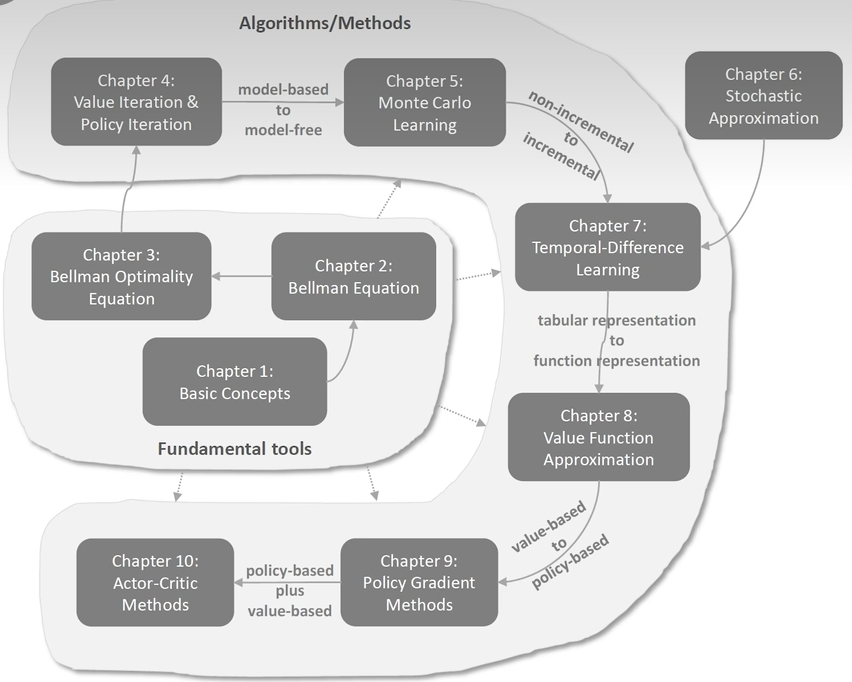

## 第一章 基本概念

### 1 基本原理

王树森老师[视频链接](https://www.bilibili.com/video/BV12o4y197US/?spm_id_from=333.788.videopod.episodes&vd_source=2173cb93b451f2278a1c87becf3ef529)

#### 1.1 基本概念

##### 1.1.1 概率论基础知识

- 随机变量(Random Variable)，记作 $X$

- 观察值，记作 $x$

- 概率密度函数 $p(x)$

- 期望 $$E(X)=\int_{-\infty}^{+\infty}xf(x)dx$$

- 随机抽样

##### 1.1.2 Terminology

- $\text{state}$ $s$ : 状态，由环境所决定
- $\text{action}$ $a$ : 动作
- $\text{agent}$ : 智能体
- $\text{policy}\ \pi$ : 决策， $$\pi(a|s) = P(A = a| S = s)$$

- $\text{reward}$ $R$ : 奖励，通常需要自己定义
- $\text{state transition}$ :  $$\text{old state} \xrightarrow{\text{action}}\text{new state}$$ 具有随机性

##### 1.1.3 Randomness in Reinforcement Learning

- $\text{Actions have randomness}$ : 动作是根据 $\text{policy}$ $\pi$ 随机抽样得到的
- $\text{State transitions have randomness}$ : 下一个 $S'$ 是由状态转移函数筹集抽样的 

##### 1.1.4 Rewards and Returns

- $\text{Return}$ : $\text{cumulative future reward}$ 

  - $$U_t=R_t+R_{t+1}+R_{t+2}+\cdots$$

- $\text{Discounted return}$ 

  - $\gamma$ : 折扣率考虑未来奖励影响的承担，属于超参数

  - $$U_t=\sum_{k = t}^{\infty}\gamma^{k - t}R_k$$

##### 1.1.5 Randomness in Returns

- 动作随机 : $$\mathbb{P}[\textcolor{red}{A=a}\ \big|\ \textcolor{green}{S=s}]=\pi(\textcolor{red}a\ |\ \textcolor{green}s)$$
- 状态随机 : $$\mathbb{P}\left[\textcolor{green}{S'=s'} \big| \textcolor{red}{A=a}, \textcolor{green}{S=s}\right] = p(\textcolor{green}{s'} | \textcolor{green}{s},\textcolor{red}{a})$$  

##### 1.1.6 Action-Value Function $$Q(\textcolor{green}{s},\textcolor{red}{a})$$

- $$Q_\pi(\textcolor{green}{s_t},\textcolor{red}{a_t})=\mathbb{E}[U_t|\textcolor{green}{S_t=s_t},\textcolor{red}{A_t=a_t}]$$
- 由于 $U_t$ 具有随机性，由 $\color{red}A_t,A_{t+1},A_{t+2},\cdots$ 和 $\color{green}S_t,S_{t+1},S_{t+2},\cdots$ 所决定
- $\mathbb{E}$ : 求期望可以将 $t$ 以后的随机性积分掉，变为一个确切的值
- 直观意义：如果用 $\text{policy}\ \pi$ 在 $\textcolor{green}{s_t}$ 状态下，做 $\textcolor{red}{a_t}$ 是好还是坏，根据分数来判断

##### 1.1.7 Optimal action-value function $Q^*(\textcolor{green}{s},\textcolor{red}{a})$

- $$Q^*(\textcolor{green}{s},\textcolor{red}{a})=\max\limits_{\pi} Q(\textcolor{green}{s},\textcolor{red}{a})$$
- 最好的 $\text{policy}\ \pi$ 是让 $Q(\textcolor{green}{s},\textcolor{red}{a})$ 最大的 $\pi$ 
- 直观意义：当智能体处于状态 $\textcolor{green}s$ 时，采取动作 $\textcolor{red}a$ 之后，按照最优策略继续和环境交互，所能获得的期望累积折扣奖励。

##### 1.1.8 State-value function $V_{\pi}(\textcolor{green}{s_t})$

- $$V_{\pi}(\textcolor{green}{s_t})=\mathbb{E}_{\textcolor{red}{A}}[Q_\pi(\textcolor{green}{s_t},\textcolor{red}{A})]$$， $\textcolor{red}{A}\sim \pi(\cdot|s_t)$
- 评价 $\text{policy}\ \pi$ 的好坏，$\pi$ 越好 $\mathbb{E}[V_\pi(S)]$ 越大
- 直观意义：$V_\pi$ 表示当前局势好还是不好

#### 1.2 Summary

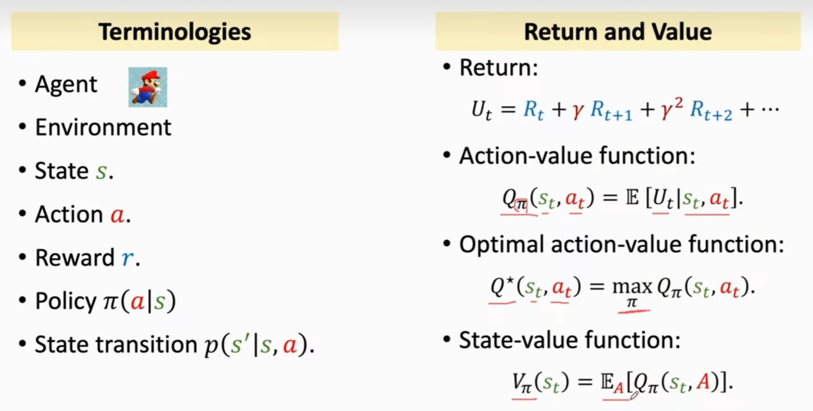

### 2 如何用强化学习打游戏（二选一）

#### 2.1 假设有一个好的 $\text{policy}\ \pi(a|s)$

- 观察当前的 $s_t$ 
- 根据决策随机采样： $\textcolor{red}{a_t}\sim \pi(\cdot|s_t)$

#### 2.2 假设已知 $Q^*(\textcolor{green}{s},\textcolor{red}{a})$

- 观察当前的 $s_t$ ，作为输入
- $\textcolor{red}{a_t}=\text{argmax}_\textcolor{red}{a} Q^*(\textcolor{green}{s_t},\textcolor{red}{a})$
- $Q^*(\textcolor{green}{s},\textcolor{red}{a})$ 告诉我们在 $s_t$ 下每一个 $\textcolor{red}{a}$ 的价值，选择使得  $Q^*(\textcolor{green}{s},\textcolor{red}{a})$ 最大的 $\textcolor{red}{a}$

#### 2.3 Summary

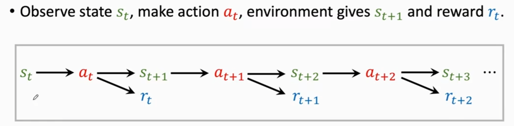

### 3 [OpenAI Gym](https://www.gymlibrary.dev/index.html)

#### 3.1 Classical control problems

<table>
    <tr>
        <td></td>
        <td></td>
    </tr>
    <tr>
        <td style="text-align: center; padding: 8px; font-weight: bold">Cart Pole</td>
        <td style="text-align: center; padding: 8px; font-weight: bold">Pendulum</td>
    </tr>
</table>

#### 3.2 Atari Games

<table>
    <tr>
        <td>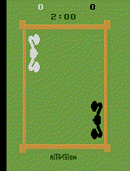</td>
        <td></td>
        <td></td>
    </tr>
    <tr>
        <td style="text-align: center; padding: 8px; font-weight: bold">Boxing</td>
        <td style="text-align: center; padding: 8px; font-weight: bold">Pong</td>
        <td style="text-align: center; padding: 8px; font-weight: bold">Tennis</td>
    </tr>
</table>
#### 3.3 MuJoCo
<table>
    <tr>
        <td></td>
        <td></td>
        <td></td>
    </tr>
    <tr>
        <td style="text-align: center; padding: 8px; font-weight: bold">Ant</td>
        <td style="text-align: center; padding: 8px; font-weight: bold">Humanoid</td>
        <td style="text-align: center; padding: 8px; font-weight: bold">Swimmer</td>
    </tr>
</table>
------


## 第二章 价值学习

### 1 Deep Q-Network (DQN)

#### 1.1 近似 Q Function

- $\text{Goal}$ : 获得最大的总奖励
- $\text{Question}$ : 如果我们已知 $Q^*(\textcolor{green}{s},\textcolor{red}{a})$ ，最好的动作 $$\textcolor{red}{a^*}=\mathop{\arg\max}\limits_{a}\ Q^*(\textcolor{green}{s},\textcolor{red}{a})$$
- $\text{Challenge}$ : 我们不知道 $Q^*(\textcolor{green}{s},\textcolor{red}{a})$
  - $\text{Solution}$ : $\text{Deep Q-Network (DQN)}$
  - 用神经网络 $Q(\textcolor{green}{s},\textcolor{red}{a};\text{w})$ 近似 $Q^*(\textcolor{green}{s},\textcolor{red}{a})$
  - $\text{w}$ 是神经网络的参数，通过奖励学习神经网络，再用神经网络给动作打分，神经网络会逐步改进

- 以 $\text{super\_mario}$ 为例

  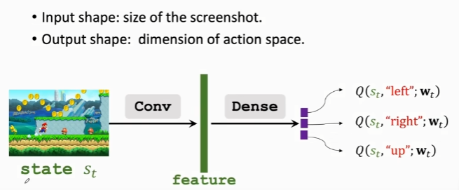

  - 图片作为输入
  - 用卷积层将图片变为特征向量
  - 最后用全连接层将特征映射到输出向量（对于 $\textcolor{red}{a}$ 的打分）

#### 1.2 用DQN打游戏

- 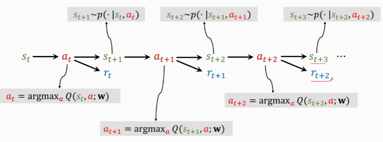
  - agent 通过 DQN 得到当前状态 $\textcolor{green}{s\\_t}$ 最优的动作 $\textcolor{red}{a\\_t}$ 
  - 环境根据状态转移函数随机得到新的环境$\textcolor{green}{s_{t+1}}$ 
  - 得到应对的奖励 $\textcolor{blue}{r\\_t}$

### 2 TD Learning

#### 2.1 举例说明

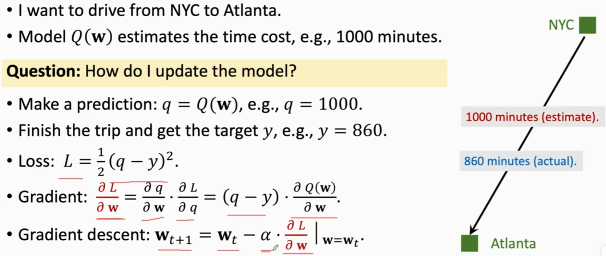

- 存在缺陷：需要走完全程才能利用梯度下降进行模型更新

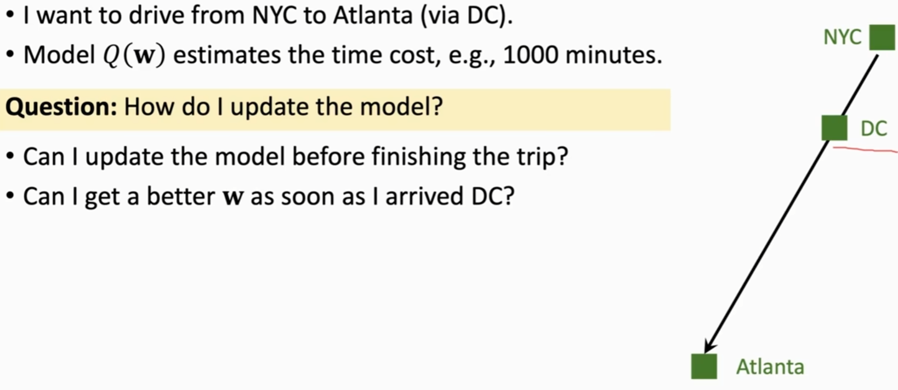

- 考虑能否根据部分的行程来更新模型
- 可以考虑TD算法进行改进，向预测过程加入部分真实数据，让预测值更接近真实值

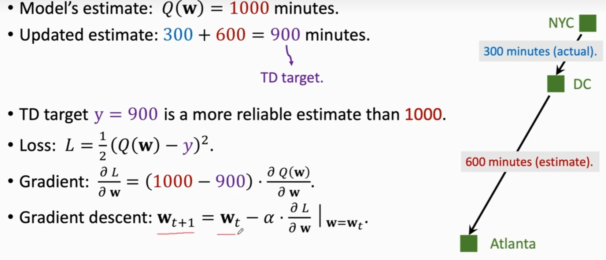

- 预计NYC到DC为 ```400min``` ，而真实值是 ```300min```
- $\text{TD error}:\delta=400-300=100$
- TD 算法需要用梯度下降减少 $\text{TD error}$

#### 2.2 TD Learning for DQN

- 样例中的 TD 的体现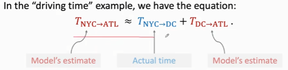

- 回忆起折扣奖励，具有类似的形式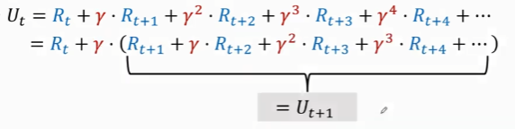


##### 2.2.1 公式梳理

-  $Q(\textcolor{green}{s_t},\textcolor{red}{a_t};\mathbf{\text{w}})$ 作为 $\text{DQN}$ 在 $t$ 时刻的输出，作为 $\mathbb{E}[U_t]$ 的近似值

  > $Q(\textcolor{green}{s_t},\textcolor{red}{a_t};\mathbf{\text{w}})$ 从 $t$  开始到结束所能获得的总奖励

- 左边是预测值，右边是TD target。反应到样例中即为，左边是从$\text{NYC}\rightarrow\text{ATL}$ ，右边是 $\text{NYC}\rightarrow\text{DC} $ + $\text{DC}\rightarrow\text{ATL} $

  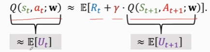

##### 2.2.2 训练 DQN 模型

- 通过当前的状态以及 agent 执行的动作
- 用 DQN 进行计算，输入是 $s_t,a_t$ ，输出是对于 $a_t$ 的打分，记作 $q_t$ 
- 用反向传播对 DQN 求导，得到梯度 $d_t$
- 环境更新状态 $s_{t+1}$ 并更新奖励 $r_t$
- 利用公式求出 TD target ，记作 $y_t$
- 利用梯度下降计算新的 $w_{t+1}$ ，目的减少 loss ，完成一轮 TD 算法的迭代

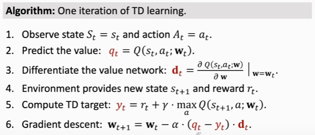

------


## 第三章 策略学习

### 1 Policy Function $\pi(\textcolor{red}a|\textcolor{green}s)$

- 回顾知识点，$\pi(\textcolor{red}a|\textcolor{green}s)$ 是一个概率密度函数
- 输入是状态 $\textcolor{green}s$ 
- 输出是一个多维向量，每个元素是一个动作 $\textcolor{red}a$ 的概率
- agent 在给定的概率值中随机抽样，并执行对应的动作 $\textcolor{red}a$

### 2 Policy Network $\pi(\textcolor{red}a|\textcolor{green}s;\theta)$

- 当状态与动作不能一一列举的时候，即不能用表格的形式进行记录，需要用函数近似，学习一个函数来近似策略函数
- 函数近似方法：
  - 线性函数
  - 神经网络

- 使用策略神经网络，$\theta$  是神经网络的参数，开始时是随机设置

- ```Softmax``` : 激活函数，使得输出是概率密度。令输出均为正数且加和为一

  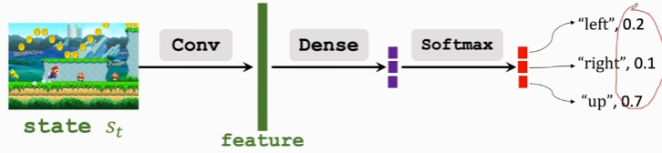

### 3 State-Value Function $V_{\pi}(\textcolor{green}{s_t})$

- $$V_{\pi}(\textcolor{green}{s_t})=\mathbb{E}_{\textcolor{red}{A}}[Q_\pi(\textcolor{green}{s_t},\textcolor{red}{A})]$$

-  $\textcolor{red}{A}\sim \pi(\cdot|\textcolor{green}{s_t})$ : $\textcolor{red}{A}$ 作为随机变量，由 $\pi$ 和 $\textcolor{green}{s_t}$ 决定

- 用期望将动作 $\textcolor{red}{A}$ 消掉
- 给定 $\text{policy}\ \pi$ ，$V_{\pi}(\textcolor{green}{s_t})$ 可以用于判断当前**状态**的好坏
- 给定 $\textcolor{green}{s_t}$ ，$V_{\pi}(\textcolor{green}{s_t})$ 可以用于判断当前**策略**的好坏

#### 3.1 近似 State-Value Function $V_{\pi}(\textcolor{green}{s_t})$

- 当 $\textcolor{red}{A}\sim \pi(\cdot|\textcolor{green}{s_t})$ ，$\textcolor{red}{A}$ 是离散的动作时，$V(s; \theta) = \sum_{a} \pi(a \mid s; \theta) \cdot Q_n(s, a)$
- 目标函数 $J(\theta) = \mathbb{E}_S[V_\theta(S;\theta)]$ ，$S$ 作为随机变量， 目标是让  $J(\theta)$ 越大越好
- 改进  $J(\theta)$ 用到梯度上升， $J(\theta)$ 越大说明神经网络近似的 $\text{policy}\ \pi$ 越好

#### 3.2 Policy Gradient

- 公式推导过程：

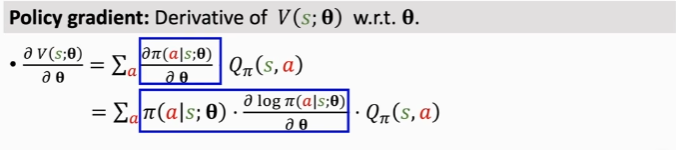

- 等式证明过程：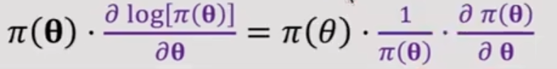

  > 在计算机科学中 $\log$ 表示为 $\ln$ 

- 推到后整理所得的式子为：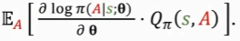

  

## 第四章 贝尔曼公式

### 1 Motivating examples

- return : The (discounted) sum of the rewards obtained along a trajectory

- how to calculate it?

- Example:  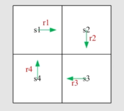

- $v_i$ : The return obtained starting from $s_i$

  - Method 1: by definition

    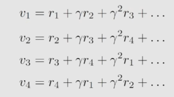

  - Method 2 : Bootstrapping

    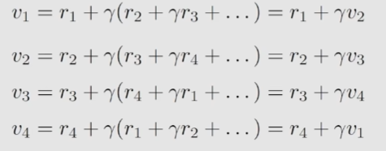

- The value of one state relies on the value of other states. 

- A matrix-vector form is more clear to see how to solve the state values.

  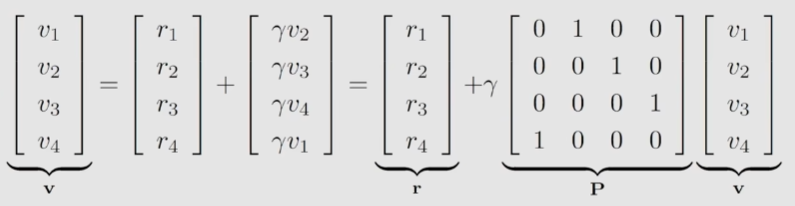

### 2 State value

- $G_t$ : define as the discounted return

  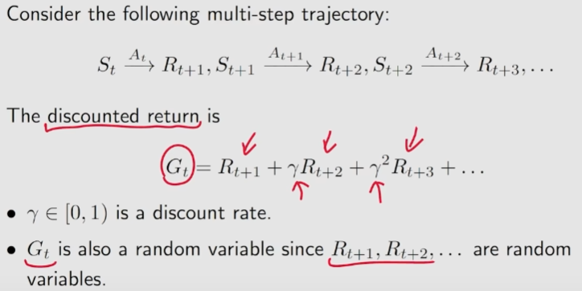

- state-value function: The expectation of $G_t$ 

  

- What is the relationship between return and state value?

  - return : 针对单个trajectory
  - state value : 对多个trajectories求平均值
  - 如果从一个state出发，一切都是确定性的，只有一条trajectory。从这个state出发得到的return和state value就是一样的

- 作用：可以计算不同策略在同一个state开始的state value，用于判断policy的好坏

### 3 Bellman equation

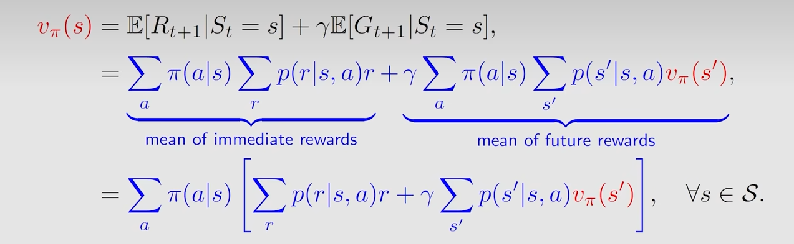

- $\pi(\textcolor{red}a|\textcolor{green}s)$ is a given policy
- $p(r|\textcolor{green}s,\textcolor{red}a)$ and $p(s'|\textcolor{green}s,\textcolor{red}a)$  represent the dynamic model or environmental model

Example:  绿色箭头表示当前的policy

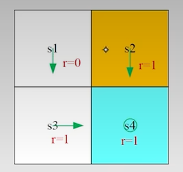

consider the state value of $s_1$ :

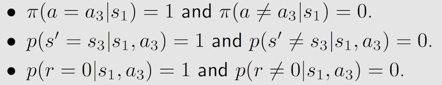
$$
v_\pi(s_1) = 0 + \gamma v_\pi(s_3)
$$
利用Bellman公式求解出在给定policy下的各个状态的state-value。

### 4 Bellman equations ：matrix-vector form

如果有 $n$ 个不同的state，那么就可以有 $n$ 个不同的Bellman公式，然后联立公式即可求解出state-value

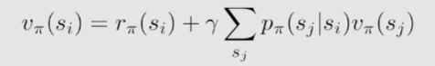

证明过程：


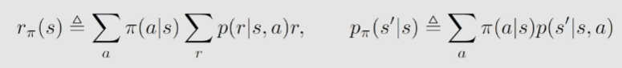

将公式转化为matrix-vector form
$$
v_\pi=r_\pi+\gamma P_\pi v_\pi
$$
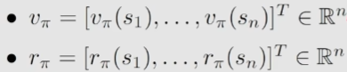

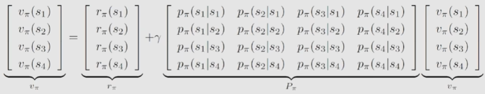

- Example:  绿色箭头表示当前的policy

  

  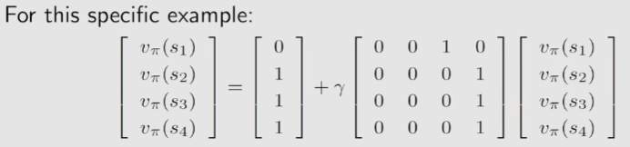

### 5 Bellman equations ：solve state value

Why to solve state value?

- policy evaluation: given a policy, finding out the corresponding state values. (根据state-value再对policy进行改进)
- 使用Bellman公式求解state-value

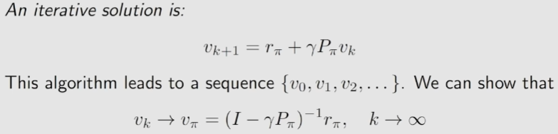

### 6 Action value

Why do we care action value?

- Because we want to know which action is better. 

Definition:
$$
Q_\pi(\textcolor{green}{s_t},\textcolor{red}{a_t})=\mathbb{E}[G_t|\textcolor{green}{S_t=s_t},\textcolor{red}{A_t=a_t}]
$$
action value 和 state value 的联系

- 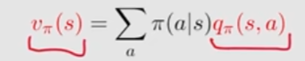
- 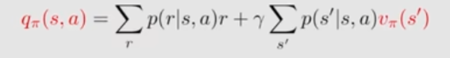

因此若已知action_value可以求出state_value,反之亦然

## 第五章 贝尔曼最优公式

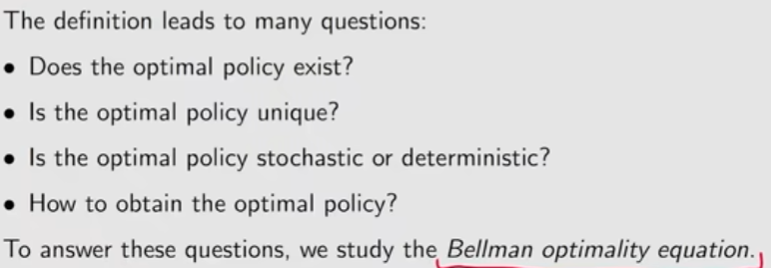

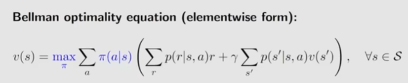

矩阵向量形式

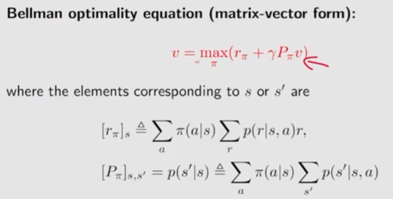

- Theorem(Contraction Mapping Theorem)

## 第六章 值迭代和策略迭代

### 值迭代算法 (Value Iteration Algorithm)

#### 过程总结：

vₖ(s) → qₖ(s,a) → 贪婪策略 πₖ₊₁(a|s) → 新值 vₖ₊₁ = maxₐ qₖ(s,a)

#### 伪代码：值迭代算法

**初始化**：所有(s,a)的概率模型p(r|s,a)和p(s'|s,a)已知。初始猜测v₀。

**目标**：求解贝尔曼最优方程，搜索最优状态值和最优策略。

当vₖ尚未收敛（即||vₖ - vₖ₋₁||大于预定义的小阈值）时，对第k次迭代，执行以下操作：

- 对每个状态s ∈ S，执行：
  - 对每个动作a ∈ A(s)，执行：
    - Q值：qₖ(s,a) = ∑ₓ p(r|s,a)r + γ∑ₛ' p(s'|s,a)vₖ(s')
    - 最大动作值：a*ₖ(s) = arg maxₐ qₖ(a,s)
    - 策略更新：如果a = a*，则πₖ₊₁(a|s) = 1，否则πₖ₊₁(a|s) = 0
    - 值更新：vₖ₊₁(s) = maxₐ qₖ(a,s)

举例说明

使用q-table记录，对于Policy update

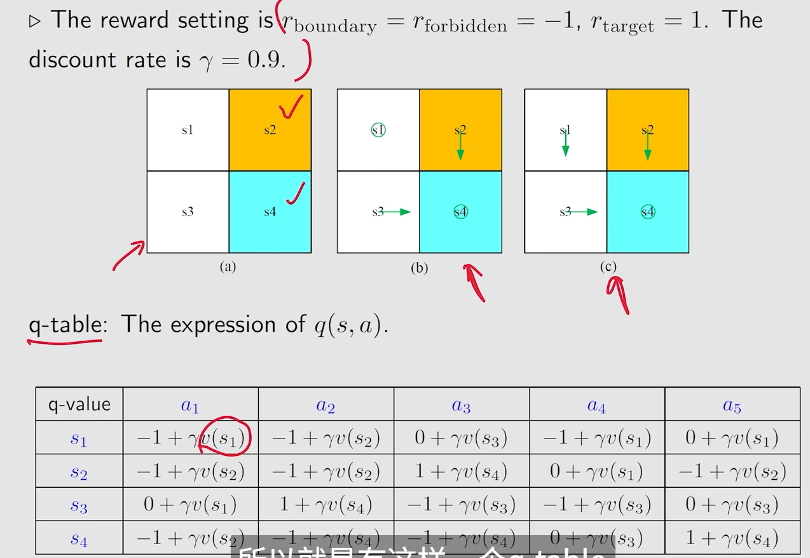

第一轮迭代

根据 $v_0$ 更新 q-table

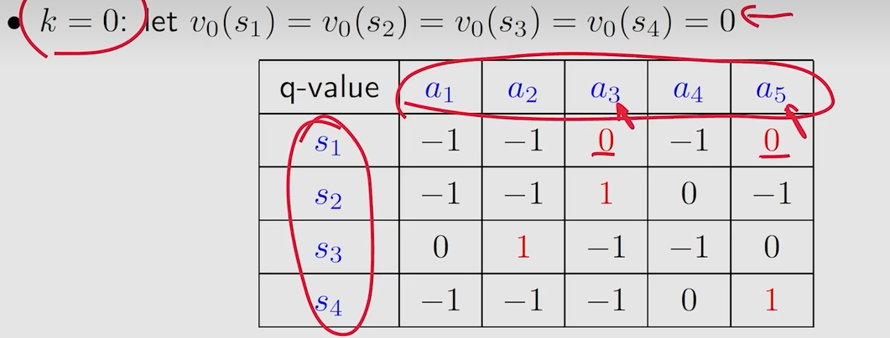

根据新的 q-table 选出每一个 state 中最大的 a ，以下为更新的 Policy

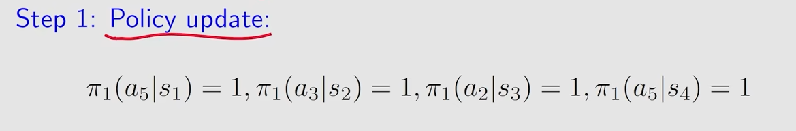

然后再更新下一轮的 $v_1$ 

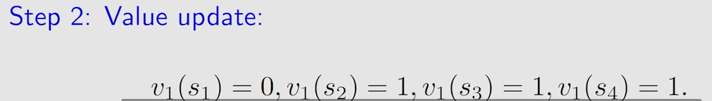

### 策略迭代算法 (Policy Iteration Algorithm)

- 与价值迭代对比

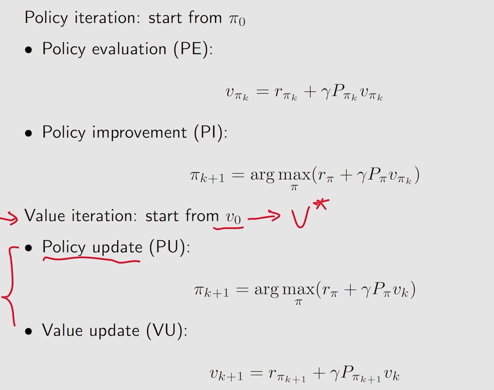

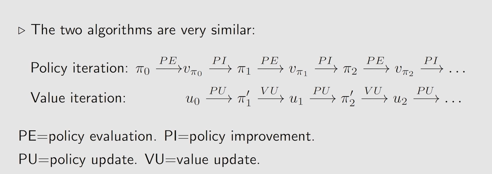

### 截断策略迭代算法

在利用Bellman公式进行迭代计算时，价值迭代和策略迭代的区别

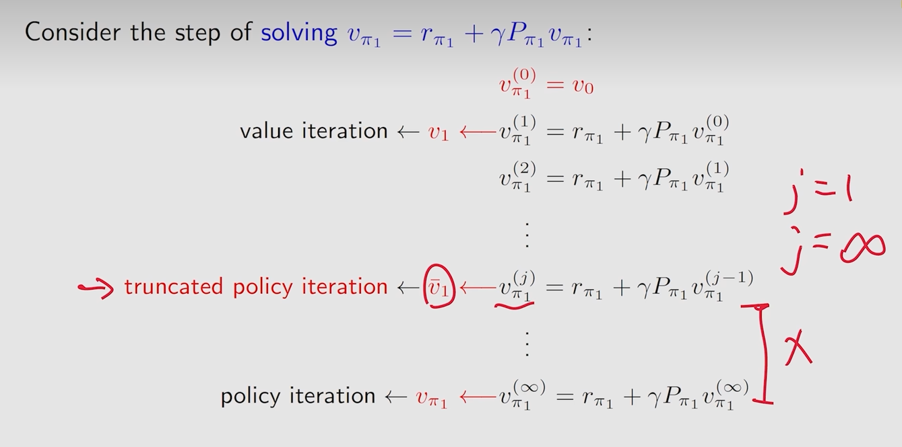

| **维度** |        标准策略迭代        |              截断策略迭代              |
| :------: | :------------------------: | :------------------------------------: |
| 策略评估 | 无限次迭代直至 *V**π* 收敛 |       仅 *k* 次迭代（*k* 有限）        |
| 计算效率 |   低（尤其状态空间大时）   |           高（减少迭代次数）           |
|  收敛性  |     严格收敛到最优策略     | 仍收敛到最优策略（因策略改进是贪心的） |
| 适用场景 |  小状态空间（如网格世界）  |       大状态空间（如机器人控制）       |

### **伪代码实现**

以下是截断策略迭代的伪代码示例（以离散状态/动作为例）：

```python
def truncated_policy_iteration(env, gamma=0.9, k=5, max_iters=100):
    # 初始化策略（确定性策略示例）
    n_states = env.n_states  # 环境 state 数
    n_actions = env.n_actions  # 每个 state 对应的 action
    policy = np.ones((n_states, n_actions)) / n_actions  # 初始随机策略
    
    # 初始化值函数
    V = np.zeros(n_states)
    
    for _ in range(max_iters):  # iteration
        # 策略评估（截断：k次迭代）
        for _ in range(k):  # k 轮迭代后，得出对应的 value function
            new_V = np.zeros(n_states)
            for s in range(n_states):
                for a in range(n_actions):
                    # 计算动作a的期望回报
                    expected_reward = sum(
                        P[s][a][s_prime] * (R[s][a][s_prime] + gamma * V[s_prime])
                        for s_prime in range(n_states)  
                    )
                    new_V[s] += policy[s][a] * expected_reward
            V = new_V
        
        # 策略改进（贪心更新）
        policy_stable = True
        for s in range(n_states):
            old_action = np.argmax(policy[s])   
            # 计算每个动作的Q值（基于当前V）
            Q_values = [
                sum(
                    P[s][a][s_prime] * (R[s][a][s_prime] + gamma * V[s_prime])
                    for s_prime in range(n_states)
                )
                for a in range(n_actions)
            ]
            best_action = np.argmax(Q_values)
            if old_action != best_action:
                policy_stable = False
                policy[s] = np.eye(n_actions)[best_action]  # 确定性策略
            
        if policy_stable:
            break  # 策略稳定，终止
    
    return policy, V
```

## 第七章 蒙特卡洛方法

### MC Basic 算法

- 在实际中很少用到，主要是了解蒙特卡洛的核心原理，与 policy iteration 相识，区别在于 MC Basic 算法不依赖于模型，在 policy evaluation 阶段不需要使用模型 (这里的模型是指在某一 state 下的 action 的概率分布)

- MC Basic 直接估计 action value。因为如果得出 state value 不能直接去改进策略，需要根据 state value 根据模型计算出 action value

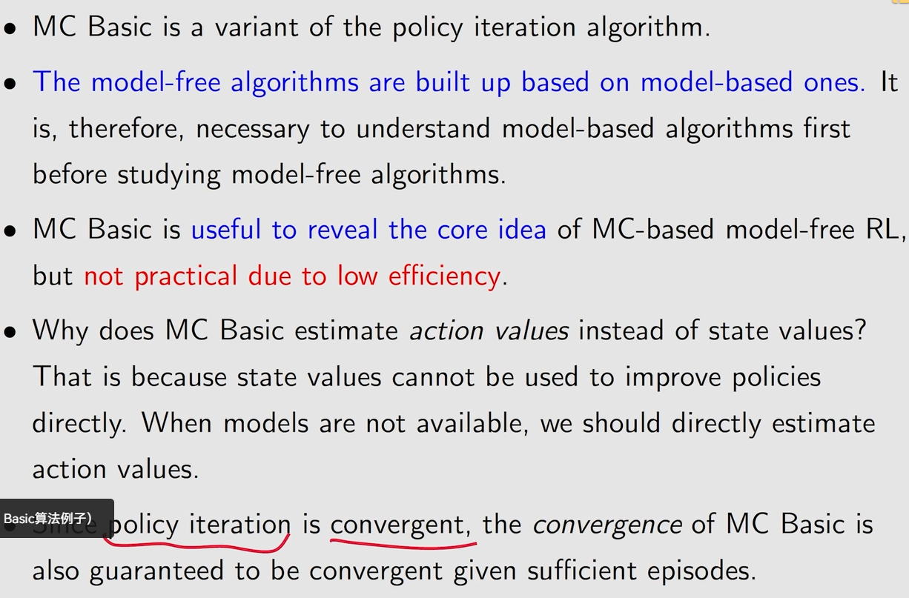
