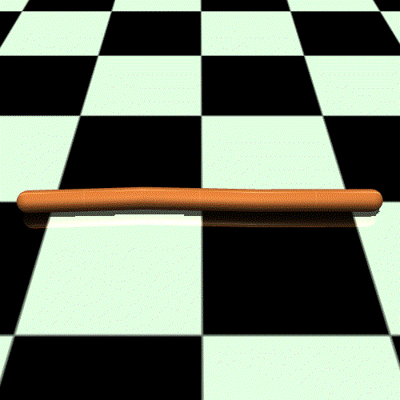

# 强化学习入门

## 第一章 基本概念

### 1 基本原理

王树森老师[视频链接](https://www.bilibili.com/video/BV12o4y197US/?spm_id_from=333.788.videopod.episodes&vd_source=2173cb93b451f2278a1c87becf3ef529)

#### 1.1 基本概念

##### 1.1.1 概率论基础知识

- 随机变量(Random Variable)，记作 $X$

- 观察值，记作 $x$

- 概率密度函数 $p(x)$

- 期望 $$E(X)=\int_{-\infty}^{+\infty}xf(x)dx$$

- 随机抽样

##### 1.1.2 Terminology

- $\text{state}$ $s$ : 状态，由环境所决定
- $\text{action}$ $a$ : 动作
- $\text{agent}$ : 智能体
- $\text{policy}\ \pi$ : 决策， $$\pi(a|s) = P(A = a| S = s)$$

- $\text{reward}$ $R$ : 奖励，通常需要自己定义
- $\text{state transition}$ :  $$\text{old state} \xrightarrow{\text{action}}\text{new state}$$ 具有随机性

##### 1.1.3 Randomness in Reinforcement Learning

- $\text{Actions have randomness}$ : 动作是根据 $\text{policy}$ $\pi$ 随机抽样得到的
- $\text{State transitions have randomness}$ : 下一个 $S'$ 是由状态转移函数筹集抽样的 

##### 1.1.4 Rewards and Returns

- $\text{Return}$ : $\text{cumulative future reward}$ 

  - $$U_t=R_t+R_{t+1}+R_{t+2}+\cdots$$

- $\text{Discounted return}$ 

  - $\gamma$ : 折扣率考虑未来奖励影响的承担，属于超参数

  - $$U_t=\sum_{k = t}^{\infty}\gamma^{k - t}R_k$$

##### 1.1.5 Randomness in Returns

- 动作随机 : $$\mathbb{P}[\textcolor{red}{A=a}\ \big|\ \textcolor{green}{S=s}]=\pi(\textcolor{red}a\ |\ \textcolor{green}s)$$
- 状态随机 : $$\mathbb{P}\left[\textcolor{green}{S'=s'} \big| \textcolor{red}{A=a}, \textcolor{green}{S=s}\right] = p(\textcolor{green}{s'} | \textcolor{green}{s},\textcolor{red}{a})$$  

##### 1.1.6 Action-Value Function $$Q(\textcolor{green}{s},\textcolor{red}{a})$$

- $$Q_\pi(\textcolor{green}{s_t},\textcolor{red}{a_t})=\mathbb{E}[U_t|\textcolor{green}{S_t=s_t},\textcolor{red}{A_t=a_t}]$$
- 由于 $U_t$ 具有随机性，由 $\color{red}A_t,A_{t+1},A_{t+2},\cdots$ 和 $\color{green}S_t,S_{t+1},S_{t+2},\cdots$ 所决定
- $\mathbb{E}$ : 求期望可以将 $t$ 以后的随机性积分掉，变为一个确切的值
- 直观意义：如果用 $\text{policy}\ \pi$ 在 $\textcolor{green}{s_t}$ 状态下，做 $\textcolor{red}{a_t}$ 是好还是坏，根据分数来判断

##### 1.1.7 Optimal action-value function $Q^*(\textcolor{green}{s},\textcolor{red}{a})$

- $$Q^*(\textcolor{green}{s},\textcolor{red}{a})=\max\limits_{\pi} Q(\textcolor{green}{s},\textcolor{red}{a})$$
- 最好的 $\text{policy}\ \pi$ 是让 $Q(\textcolor{green}{s},\textcolor{red}{a})$ 最大的 $\pi$ 
- 直观意义：当智能体处于状态 $\textcolor{green}s$ 时，采取动作 $\textcolor{red}a$ 之后，按照最优策略继续和环境交互，所能获得的期望累积折扣奖励。

##### 1.1.8 State-value function $V_{\pi}(\textcolor{green}{s_t})$

- $$V_{\pi}(\textcolor{green}{s_t})=\mathbb{E}_{\textcolor{red}{A}}[Q_\pi(\textcolor{green}{s_t},\textcolor{red}{A})]$$， $\textcolor{red}{A}\sim \pi(\cdot|s_t)$
- 评价 $\text{policy}\ \pi$ 的好坏，$\pi$ 越好 $\mathbb{E}[V_\pi(S)]$ 越大
- 直观意义：$V_\pi$ 表示当前局势好还是不好

#### 1.2 Summary


### 2 如何用强化学习打游戏（二选一）

#### 2.1 假设有一个好的 $\text{policy}\ \pi(a|s)$

- 观察当前的 $s_t$ 
- 根据决策随机采样： $\textcolor{red}{a_t}\sim \pi(\cdot|s_t)$

#### 2.2 假设已知 $Q^*(\textcolor{green}{s},\textcolor{red}{a})$

- 观察当前的 $s_t$ ，作为输入
- $\textcolor{red}{a_t}=\text{argmax}_\textcolor{red}{a} Q^*(\textcolor{green}{s_t},\textcolor{red}{a})$
- $Q^*(\textcolor{green}{s},\textcolor{red}{a})$ 告诉我们在 $s_t$ 下每一个 $\textcolor{red}{a}$ 的价值，选择使得  $Q^*(\textcolor{green}{s},\textcolor{red}{a})$ 最大的 $\textcolor{red}{a}$

#### 2.3 Summary


### 3 [OpenAI Gym](https://www.gymlibrary.dev/index.html)

#### 3.1 Classical control problems

<table>
    <tr>
        <td></td>
        <td></td>
    </tr>
    <tr>
        <td style="text-align: center; padding: 8px; font-weight: bold">Cart Pole</td>
        <td style="text-align: center; padding: 8px; font-weight: bold">Pendulum</td>
    </tr>
</table>

#### 3.2 Atari Games

<table>
    <tr>
        <td></td>
        <td></td>
        <td></td>
    </tr>
    <tr>
        <td style="text-align: center; padding: 8px; font-weight: bold">Boxing</td>
        <td style="text-align: center; padding: 8px; font-weight: bold">Pong</td>
        <td style="text-align: center; padding: 8px; font-weight: bold">Tennis</td>
    </tr>
</table>
#### 3.3 MuJoCo
<table>
    <tr>
        <td></td>
        <td></td>
        <td></td>
    </tr>
    <tr>
        <td style="text-align: center; padding: 8px; font-weight: bold">Ant</td>
        <td style="text-align: center; padding: 8px; font-weight: bold">Humanoid</td>
        <td style="text-align: center; padding: 8px; font-weight: bold">Swimmer</td>
    </tr>
</table>
------


## 第二章 价值学习

### 1 Deep Q-Network (DQN)

#### 1.1 近似 Q Function

- $\text{Goal}$ : 获得最大的总奖励
- $\text{Question}$ : 如果我们已知 $Q^*(\textcolor{green}{s},\textcolor{red}{a})$ ，最好的动作 $$\textcolor{red}{a^*}=\mathop{\arg\max}\limits_{a}\ Q^*(\textcolor{green}{s},\textcolor{red}{a})$$
- $\text{Challenge}$ : 我们不知道 $Q^*(\textcolor{green}{s},\textcolor{red}{a})$
  - $\text{Solution}$ : $\text{Deep Q-Network (DQN)}$
  - 用神经网络 $Q(\textcolor{green}{s},\textcolor{red}{a};\text{w})$ 近似 $Q^*(\textcolor{green}{s},\textcolor{red}{a})$
  - $\text{w}$ 是神经网络的参数，通过奖励学习神经网络，再用神经网络给动作打分，神经网络会逐步改进

- 以 $\text{super\_mario}$ 为例

  

  - 图片作为输入
  - 用卷积层将图片变为特征向量
  - 最后用全连接层将特征映射到输出向量（对于 $\textcolor{red}{a}$ 的打分）

#### 1.2 用DQN打游戏

- 
  - agent 通过 DQN 得到当前状态 $\textcolor{green}{s\\_t}$ 最优的动作 $\textcolor{red}{a\\_t}$ 
  - 环境根据状态转移函数随机得到新的环境$\textcolor{green}{s_{t+1}}$ 
  - 得到应对的奖励 $\textcolor{blue}{r\\_t}$

### 2 TD Learning

#### 2.1 举例说明


- 存在缺陷：需要走完全程才能利用梯度下降进行模型更新


- 考虑能否根据部分的行程来更新模型
- 可以考虑TD算法进行改进，向预测过程加入部分真实数据，让预测值更接近真实值


- 预计NYC到DC为 ```400min``` ，而真实值是 ```300min```
- $\text{TD error}:\delta=400-300=100$
- TD 算法需要用梯度下降减少 $\text{TD error}$

#### 2.2 TD Learning for DQN

- 样例中的 TD 的体现

- 回忆起折扣奖励，具有类似的形式


##### 2.2.1 公式梳理

-  $Q(\textcolor{green}{s_t},\textcolor{red}{a_t};\mathbf{\text{w}})$ 作为 $\text{DQN}$ 在 $t$ 时刻的输出，作为 $\mathbb{E}[U_t]$ 的近似值

  > $Q(\textcolor{green}{s_t},\textcolor{red}{a_t};\mathbf{\text{w}})$ 从 $t$  开始到结束所能获得的总奖励

- 左边是预测值，右边是TD target。反应到样例中即为，左边是从$\text{NYC}\rightarrow\text{ATL}$ ，右边是 $\text{NYC}\rightarrow\text{DC} $ + $\text{DC}\rightarrow\text{ATL} $

  

##### 2.2.2 训练 DQN 模型

- 通过当前的状态以及 agent 执行的动作
- 用 DQN 进行计算，输入是 $s_t,a_t$ ，输出是对于 $a_t$ 的打分，记作 $q_t$ 
- 用反向传播对 DQN 求导，得到梯度 $d_t$
- 环境更新状态 $s_{t+1}$ 并更新奖励 $r_t$
- 利用公式求出 TD target ，记作 $y_t$
- 利用梯度下降计算新的 $w_{t+1}$ ，目的减少 loss ，完成一轮 TD 算法的迭代


------

